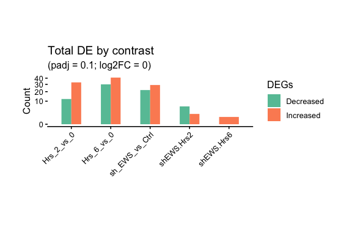
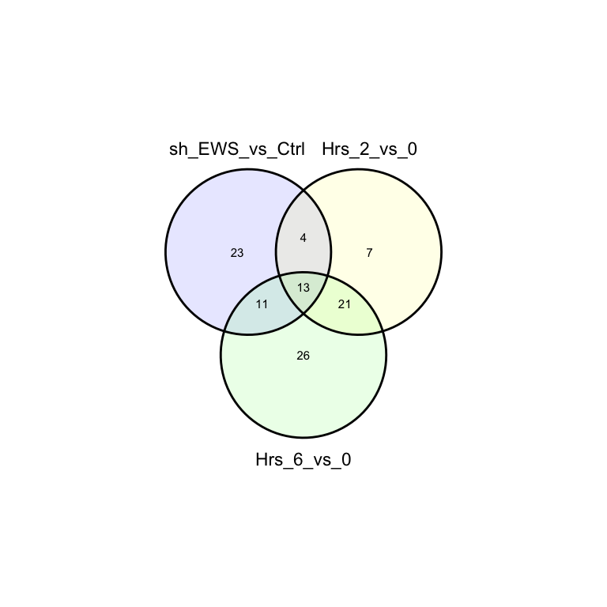
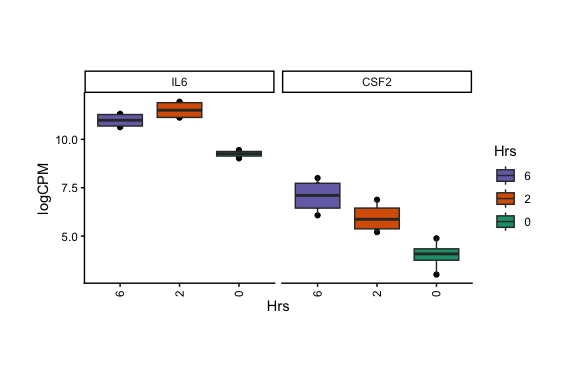
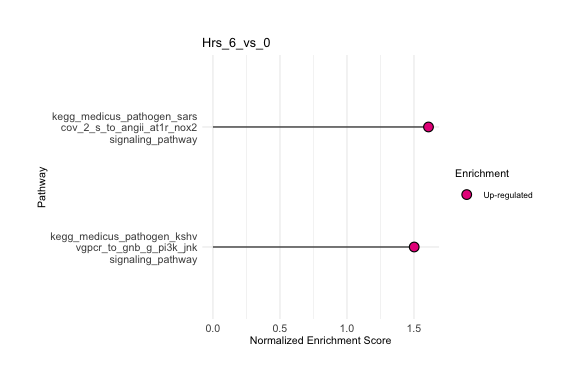
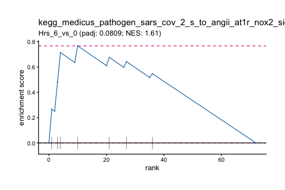

<!-- README.md is generated from README.Rmd. Please edit that file -->

# Hotgenes R package! 

<br>

## Installation requires R (\>= 4.2.0); however R (\>= 4.3.0) is recommended

``` r
# Install required packages. ----------------------------------------------
install.packages(c("devtools", "BiocManager"), dependencies = TRUE)

BiocManager::install("apeglm")

# install Hotgenes -------------------------------------------------------
# set repos
options(repos = c(
  CRAN = "https://cran.rstudio.com/",
  BiocManager::repositories()[1:4]
))

devtools::install_github("pfizer-opensource/Open-Hotgenes",
                         dependencies = TRUE)
```

## License information

The contents of this repository are provided under the Apache v2.0
license as laid out in the [LICENSE](LICENSE) file.

## Background

Hotgenes is an R package built to remove bottlenecks from omics
collaborations. It contains a modular shiny application with a wide
range of flexible tools (PCA, GSEA, GSVA, and more!) designed for
brainstorming omics data interpretations among collaborators. The
functions supporting these tools are accessible outside of the shiny
application, which can be used for adhoc queries or for building custom
pipelines.

## Why are Pfizer sharing this?

Science will win! Simplified omics data analysis means more winning.

## What is the benefit of this work?

Omics analysis with fewer bottlenecks.

## How should I submit questions, queries and enhancements?

You should fork this repository and submit a pull-request.

## Developers

Richard Virgen-Slane

## How does Hotgenes work?

### For any kind of differential expression analysis, you’ll have:

1)  Sample metadata

2)  Normalized expression data

3)  Feature-aliases

4)  Feature-associated statistics

5)  Auxiliary assays

### These can be imported into a Hotgenes object

Omics data and be directly imported from DESeq2 (via HotgenesDEseq2())
or limma (via Hotgeneslimma()).

For others platforms, check out the HotgenesUniversal() function.

## Convert DESeq2 analysis into a Hotgenes Object

``` r
 require(Hotgenes)

  # incase you wanted to include aliases for your genes
  # requires a "Feature" column that contains gene names in expression matrix
  dbCon <- org.Hs.eg.db::org.Hs.eg_dbconn()
  sqlQuery <- "SELECT * FROM ENSEMBL, gene_info WHERE ENSEMBL._id == gene_info._id;"

  ensembl_Symbol <- DBI::dbGetQuery(dbCon, sqlQuery) %>%
  dplyr::select(c("Feature" = "symbol", "ensembl_id"))


  # HotgenesDEseq2 ----------------------------------------------------------
  require(DESeq2)
  
  # loading example data
  dds_con_dir <- system.file("extdata",
    "dds_con.Rdata",
    package = "Hotgenes",
    mustWork = TRUE
  )
  load(dds_con_dir)

  # Example Expression data and coldata
  cts <- DESeq2::counts(dds_con) %>% as.data.frame()
  Design <- SummarizedExperiment::colData(dds_con) %>%
    base::as.data.frame() %>%
    dplyr::select_if(is.factor) %>%
    dplyr::mutate(Time = as.numeric(levels(.data$Hrs))[.data$Hrs])

  # set up DESeq2
  model_DESeq <- eval(~ sh * Hrs)

  dds <- DESeq2::DESeqDataSetFromMatrix(
    countData = cts,
    colData = Design,
    design = model_DESeq
  )

  dds <- DESeq2::DESeq(dds)
```

    ## estimating size factors

    ## estimating dispersions

    ## gene-wise dispersion estimates

    ## mean-dispersion relationship

    ## final dispersion estimates

    ## fitting model and testing

``` r
  # Convert to Hotgenes Object

  dds_Hotgenes <- HotgenesDEseq2(
    DEseq2_object = dds,
    lfcShrink_type = "apeglm",
    contrasts = "sh_EWS_vs_Ctrl", 
    ExpressionData = "vsd", 
    Mapper = ensembl_Symbol
  )
```

    ## using 'apeglm' for LFC shrinkage. If used in published research, please cite:
    ##     Zhu, A., Ibrahim, J.G., Love, M.I. (2018) Heavy-tailed prior distributions for
    ##     sequence count data: removing the noise and preserving large differences.
    ##     Bioinformatics. https://doi.org/10.1093/bioinformatics/bty895

## Convert limma DE analysis into Hotgenes Object

``` r
 require(Hotgenes)
  
  # incase you wanted to include aliases for your genes
  # requires a "Feature" column that contains gene names in expression matrix
  dbCon <- org.Hs.eg.db::org.Hs.eg_dbconn()
  sqlQuery <-
    "SELECT * FROM ENSEMBL, gene_info WHERE ENSEMBL._id == gene_info._id;"
  
  ensembl_Symbol <- DBI::dbGetQuery(dbCon, sqlQuery) %>%
  dplyr::select(c("Feature" = "symbol", "ensembl_id"))
  
  
  
  # Hotgeneslimma -----------------------------------------------------------
  require(DESeq2)

  dds_con_dir <- system.file("extdata",
                             "dds_con.Rdata",
                             package = "Hotgenes",
                             mustWork = TRUE)
  load(dds_con_dir)
  
  # Example Expression data and coldata
  cts <- counts(dds_con) %>% as.data.frame()
  Design <- colData(dds_con) %>%
    base::as.data.frame() %>%
    dplyr::select_if(is.factor) %>%
    dplyr::mutate(Time = as.numeric(levels(.data$Hrs))[.data$Hrs])
  
  # Create DGEList object
  # and calculate normalization factors
  d0 <- edgeR::DGEList(cts)
  d0 <- edgeR::calcNormFactors(d0)
  
  # Filter low-expressed genes
  # disabled in this example
  if (FALSE) {
    cutoff <- 1
    drop <- which(apply(cpm(d0), 1, max) < cutoff)
    d <- d0[-drop,]
    dim(d) # number of genes lef
  }
  
  d <- d0
  
  # make a model.matrix
  model_Matrix <- model.matrix( ~ sh * Hrs,
                                data = Design)
  # voom
  vm_exp <- limma::voom(d, model_Matrix)
  
  # make fit
  fit <- limma::lmFit(vm_exp, model_Matrix)
  fit <- limma::eBayes(fit)
  
  # Get alternative exps
  alt_Exp <- list(counts = data.matrix(d0))
  
  # Convert to Hotgenes Object
  fit_Hotgenes <- Hotgeneslimma(
    limmafit = fit,
    coldata = Design,
    Expression = vm_exp,
    Expression_name = "logCPM",
    Exps_list = alt_Exp,
    Mapper = ensembl_Symbol
  )
```

## For other platforms you can generate a hotgenes object using HotgenesUniversal().

``` r
library(Hotgenes)
  
  
  # load example data -------------------------------------------------------
  
  dds_Hotgenes_dir <- system.file("extdata",
                                  paste0("dds_Hotgenes", ".RDS"),
                                  package = "Hotgenes",
                                  mustWork = TRUE
  )
  
  htgs <- readRDS(dds_Hotgenes_dir)
  
  # preparing data -----------------------------------------------------------
  
  # Getting example named list of DE statistics
  NewDE <- Output_DE_(htgs, as_list = TRUE, padj_cut = 1)
  
  # Getting example named list of normalized data
  NormlData <- Normalized_Data_(htgs)
   
  # Getting example coldata
  ExpColdata <- coldata_(htgs)

  # Getting example original data object used for DE analysis
  # This example was generated from DESeq2
  OrigDEObj <- O_(htgs)
  OrigDEObj %>% class()
```

    ## [1] "DESeqDataSet"
    ## attr(,"package")
    ## [1] "DESeq2"

``` r
  # Getting example design matrix
  DE_design <- designMatrix_(htgs)
  
  # Getting example mapper
  MapperDF <- Mapper_(htgs)
  
  
  # Converting example objects to hotgenes
  Hotgenes_Object <- HotgenesUniversal(
    Output_DE = NewDE,
    Normalized_Expression = NormlData,
    coldata = ExpColdata,
    Original_Object = OrigDEObj,
    designMatrix = DE_design,
    Mapper = MapperDF
  )
```

## What can you do with a Hotgenes object?

calling a Hotgenes object returns a summary table

``` r
library(Hotgenes)

fit_Hotgenes
```

    ## class: Hotgenes 
    ## Original class/package:  EList/limma
    ## 
    ## Differential expression (default thresholds): 
    ## |contrast       | total|
    ## |:--------------|-----:|
    ## |Hrs_2_vs_0     |    45|
    ## |Hrs_6_vs_0     |    71|
    ## |sh_EWS_vs_Ctrl |    51|
    ## |shEWS.Hrs2     |     8|
    ## |shEWS.Hrs6     |     1|
    ## 
    ## Available feature mapping:  Feature, ensembl_id 
    ## ExpressionSlots:  logCPM, counts 
    ## Total auxiliary assays:  2 
    ## Total samples:  12

Sample metadata

``` r
coldata_(fit_Hotgenes)
```

    ##                sh Bio_Rep Hrs Time
    ## shCON_0hrs_1 Ctrl       1   0    0
    ## shCON_0hrs_2 Ctrl       2   0    0
    ## shCON_2hrs_1 Ctrl       1   2    2
    ## shCON_2hrs_2 Ctrl       2   2    2
    ## shCON_6hrs_1 Ctrl       1   6    6
    ## shCON_6hrs_2 Ctrl       2   6    6
    ## shEWS_0hrs_1  EWS       1   0    0
    ## shEWS_0hrs_2  EWS       2   0    0
    ## shEWS_2hrs_1  EWS       1   2    2
    ## shEWS_2hrs_2  EWS       2   2    2
    ## shEWS_6hrs_1  EWS       1   6    6
    ## shEWS_6hrs_2  EWS       2   6    6

Normalized expression data

``` r
ExpressionData_(fit_Hotgenes)[c(1:3), c(1:3)]
```

    ##        shCON_0hrs_1 shCON_0hrs_2 shCON_2hrs_1
    ## AGER       5.699205     6.356261     6.030818
    ## ALOX12     3.377277     3.372749     3.472823
    ## ALOX15     5.699205     5.795961     5.512351

Available aliases

``` r
Mapper_(fit_Hotgenes) %>% head()
```

    ## # A tibble: 6 × 2
    ##   Feature ensembl_id     
    ##   <chr>   <chr>          
    ## 1 AGER    ENSG00000204305
    ## 2 AGER    ENSG00000230514
    ## 3 AGER    ENSG00000229058
    ## 4 AGER    ENSG00000231268
    ## 5 AGER    ENSG00000237405
    ## # ℹ 1 more row

Available auxiliary_assays

``` r
auxiliary_assays_(fit_Hotgenes)
```

    ##                  assay1      assay2
    ## shCON_0hrs_1 -1.4805676 -0.77956651
    ## shCON_0hrs_2  1.5771695  0.01195176
    ## shCON_2hrs_1 -0.9567445 -0.15241624
    ## shCON_2hrs_2 -0.9200052 -0.70346425
    ## shCON_6hrs_1 -1.9976421  1.18887916
    ## shCON_6hrs_2 -0.2722960  0.34051227
    ## shEWS_0hrs_1 -0.3153487  0.50696817
    ## shEWS_0hrs_2 -0.6282552 -0.29330515
    ## shEWS_2hrs_1 -0.1064639  0.22364142
    ## shEWS_2hrs_2  0.4280148  2.00720146
    ## shEWS_6hrs_1 -0.7777196  1.01197912
    ## shEWS_6hrs_2 -1.2938823 -0.30245925

## Easy access to features of interest

### Feature-associated statistics.

``` r
DE(fit_Hotgenes, Topn = 3)
```

    ## $Hrs_2_vs_0
    ## # A tibble: 3 × 11
    ##   Feature contrast_dir  baseMean log2FoldChange    FC  stat   pvalue     padj     t     B ensembl_id     
    ##   <chr>   <chr>            <dbl>          <dbl> <dbl> <dbl>    <dbl>    <dbl> <dbl> <dbl> <chr>          
    ## 1 IL6     Hrs_2_vs_0_up     10.6           2.52  5.72  31.1 4.06e-24 1.04e-21  31.1  45.1 ENSG00000136244
    ## 2 CXCL8   Hrs_2_vs_0_up     10.9           3.51 11.4   26.0 6.99e-22 8.92e-20  26.0  40.0 ENSG00000169429
    ## 3 TNFAIP3 Hrs_2_vs_0_up     10.5           2.14  4.42  24.9 2.21e-21 1.88e-19  24.9  38.8 ENSG00000118503
    ## 
    ## $Hrs_6_vs_0
    ## # A tibble: 3 × 11
    ##   Feature contrast_dir  baseMean log2FoldChange    FC  stat   pvalue     padj     t     B ensembl_id     
    ##   <chr>   <chr>            <dbl>          <dbl> <dbl> <dbl>    <dbl>    <dbl> <dbl> <dbl> <chr>          
    ## 1 CXCL8   Hrs_6_vs_0_up     10.9           3.56 11.8   26.4 4.21e-22 1.07e-19  26.4  40.5 ENSG00000169429
    ## 2 CXCL1   Hrs_6_vs_0_up     11.3           2.35  5.09  24.5 3.71e-21 4.73e-19  24.5  38.2 ENSG00000163739
    ## 3 CCL2    Hrs_6_vs_0_up     12.5           1.25  2.37  23.0 2.14e-20 1.56e-18  23.0  36.3 ENSG00000108691
    ## 
    ## $sh_EWS_vs_Ctrl
    ## # A tibble: 3 × 11
    ##   Feature contrast_dir        baseMean log2FoldChange    FC  stat   pvalue     padj     t     B ensembl_id     
    ##   <chr>   <chr>                  <dbl>          <dbl> <dbl> <dbl>    <dbl>    <dbl> <dbl> <dbl> <chr>          
    ## 1 C1R     sh_EWS_vs_Ctrl_down     13.5         -0.856 0.553 -16.7 1.33e-16 3.39e-14 -16.7  27.7 ENSG00000159403
    ## 2 C1R     sh_EWS_vs_Ctrl_down     13.5         -0.856 0.553 -16.7 1.33e-16 3.39e-14 -16.7  27.7 ENSG00000288512
    ## 3 CCL2    sh_EWS_vs_Ctrl_down     12.5         -1.00  0.500 -15.8 5.92e-16 7.55e-14 -15.8  26.4 ENSG00000108691
    ## 
    ## $shEWS.Hrs2
    ## # A tibble: 3 × 11
    ##   Feature contrast_dir    baseMean log2FoldChange    FC  stat    pvalue   padj     t       B ensembl_id     
    ##   <chr>   <chr>              <dbl>          <dbl> <dbl> <dbl>     <dbl>  <dbl> <dbl>   <dbl> <chr>          
    ## 1 TNFAIP3 shEWS.Hrs2_down    10.5          -0.565 0.676 -4.69 0.0000584 0.0149 -4.69  1.77   ENSG00000118503
    ## 2 CXCL3   shEWS.Hrs2_down     7.90         -1.05  0.482 -3.94 0.000457  0.0233 -3.94 -0.0744 ENSG00000163734
    ## 3 FOS     shEWS.Hrs2_up       8.98          0.645 1.56   4.14 0.000267  0.0233  4.14  0.398  ENSG00000170345
    ## 
    ## $shEWS.Hrs6
    ## # A tibble: 1 × 11
    ##   Feature contrast_dir  baseMean log2FoldChange    FC  stat    pvalue   padj     t     B ensembl_id     
    ##   <chr>   <chr>            <dbl>          <dbl> <dbl> <dbl>     <dbl>  <dbl> <dbl> <dbl> <chr>          
    ## 1 FOS     shEWS.Hrs6_up     8.98          0.826  1.77  4.53 0.0000892 0.0227  4.53  1.12 ENSG00000170345

### Summary plot of contrasts

all comparisons

``` r
DEPlot(fit_Hotgenes, .log2FoldChange = 0, padj_cut = 0.1)
```

<!-- -->

Check for a feature of interest

``` r
# Check a feature across comparisons
DEPlot(fit_Hotgenes, hotList = "CSF1", .log2FoldChange = 0, padj_cut = 0.1)
```

<!-- -->

### Volcano plots

``` r
VPlot(fit_Hotgenes, 
      .log2FoldChange = 1, padj_cut = 0.1,
      contrasts = "sh_EWS_vs_Ctrl")
```

<!-- -->

### Identify overlapping features across comparisons with Venn_Report()

``` r
# Venn Diagram plot
fit_Hotgenes %>% 
   DE(
      Report = "Features",
      contrasts = c("sh_EWS_vs_Ctrl", "Hrs_2_vs_0", "Hrs_6_vs_0"),
      .log2FoldChange = 0, padj_cut = 0.1
    ) %>%
    Venn_Report()
```

    ## Coordinate system already present. Adding new coordinate system, which will replace the existing one.

    ## $vennD

<!-- -->

    ## 
    ## $Intsect
    ## $Intsect$Hrs_2_vs_0
    ## [1] "NFE2L2" "KEAP1"  "PDGFA"  "HDAC4"  "OXER1"  "GAPDH"  "MEF2C" 
    ## 
    ## $Intsect$Hrs_6_vs_0
    ##  [1] "CXCL5"  "STAT2"  "NR3C1"  "MAP3K1" "HSPB2"  "MAPK8"  "DAXX"   "MKNK1"  "MAP2K6" "IL1B"   "BCL6"   "TLR3"  
    ## [13] "GRB2"   "IL6R"   "IL15"   "CREB1"  "IL1RN"  "RELA"   "IFIT3"  "MAP3K5" "TGFB3"  "TGFB2"  "IL1A"   "CCL20" 
    ## [25] "PGK1"   "MAPK3" 
    ## 
    ## $Intsect$sh_EWS_vs_Ctrl
    ##  [1] "HIF1A"  "C3"     "RAC1"   "GNB1"   "TUBB"   "BCL2L1" "CSF1"   "PTGER3" "ROCK2"  "MX2"    "HMGN1"  "CLTC"  
    ## [13] "GNAQ"   "LY96"   "CD40"   "CFD"    "HRAS"   "RHOA"   "HPRT1"  "TCF4"   "MX1"    "OAS2"   "LTB4R2"
    ## 
    ## $Intsect$`Hrs_2_vs_0:Hrs_6_vs_0`
    ##  [1] "CXCL8"   "TNFAIP3" "CXCL1"   "IL11"    "PTGS2"   "DDIT3"   "IFIT2"   "TGFBR1"  "MAFF"    "CXCR4"   "MAFK"   
    ## [12] "PTGFR"   "FOS"     "MYC"     "RIPK2"   "IL2"     "MAFG"    "CSF2"    "TWIST2"  "IFIT1"   "FLT1"   
    ## 
    ## $Intsect$`sh_EWS_vs_Ctrl:Hrs_2_vs_0`
    ## [1] "HMGB2"  "MAP3K9" "CEBPB"  "IRF1"  
    ## 
    ## $Intsect$`sh_EWS_vs_Ctrl:Hrs_6_vs_0`
    ##  [1] "C1R"   "C1S"   "MMP3"  "CXCL6" "STAT1" "PTGS1" "HMGB1" "MASP1" "TRAF2" "IFI44" "CCL7" 
    ## 
    ## $Intsect$`sh_EWS_vs_Ctrl:Hrs_2_vs_0:Hrs_6_vs_0`
    ##  [1] "CCL2"     "IL1R1"    "MEF2D"    "JUN"      "BIRC2"    "CXCL3"    "MEF2A"    "CXCL2"    "IL6"      "NFKB1"   
    ## [11] "SMAD7"    "MAPKAPK2" "RELB"    
    ## 
    ## 
    ## $Names
    ## [1] "Hrs_2_vs_0:Hrs_6_vs_0"                "sh_EWS_vs_Ctrl:Hrs_2_vs_0"           
    ## [3] "sh_EWS_vs_Ctrl:Hrs_6_vs_0"            "sh_EWS_vs_Ctrl:Hrs_2_vs_0:Hrs_6_vs_0"

### Identify key features using PCA and clustering

``` r
# run PCA
# set contrast of choice and metadata variables
FactoOutput <- FactoWrapper(fit_Hotgenes,
  contrasts = "Hrs_6_vs_0",
  coldata_ids = c("Hrs", "sh"),
  biplot = FALSE
)
```

``` r
# plot
FactoOutput$res_PPI_pa_1
```

<!-- -->

``` r
# getting HCPC details
FactoOutput$TopTibble # Feature
```

    ## # A tibble: 88 × 9
    ##   Cluster Interpretation       Feature v.test `Mean in category` `Overall mean` `sd in category` `Overall sd` p.value
    ##   <fct>   <fct>                <chr>    <dbl>              <dbl>          <dbl>            <dbl>        <dbl>   <dbl>
    ## 1 1       Cluster has elevated IFIT2     2.91               10.3           9.89           0.100        0.339  0.00362
    ## 2 1       Cluster has elevated DDIT3     2.75               10.4          10.1            0.0402       0.231  0.00593
    ## 3 1       Cluster has elevated MAP3K1    2.72               10.0           9.75           0.0537       0.216  0.00660
    ## 4 1       Cluster has elevated PTGFR     2.65               10.4          10.1            0.0489       0.285  0.00797
    ## 5 1       Cluster has elevated PGK1      2.63               15.3          15.2            0.0224       0.0484 0.00851
    ## # ℹ 83 more rows

``` r
FactoOutput$TopGroups # TopGroups
```

    ## # A tibble: 1 × 8
    ##   Cluster Interpretation       Category  `Cla/Mod` `Mod/Cla` Global p.value v.test
    ##   <fct>   <fct>                <chr>         <dbl>     <dbl>  <dbl>   <dbl>  <dbl>
    ## 1 1       Cluster has elevated Hrs=Hrs_0       100       100   33.3 0.00202   3.09

### Streamlined expression plots

``` r
# Having metadata embedded with expression data means easier plotting
yvar <- c("CSF2", "IL6")
xvar <- "Hrs"

ExpsPlot(fit_Hotgenes,
  xVar = xvar,
  yVar = yvar,
  fill = "Hrs",
  boxplot = TRUE
)
```

<!-- -->

``` r
# Subset data on the fly
ExpsPlot(fit_Hotgenes,
  xVar = xvar,
  yVar = yvar,
  filter_eval = Hrs != 2,
  fill = "Hrs",
  boxplot = TRUE

)
```

<!-- -->

``` r
# Reorder data on the fly
ExpsPlot(fit_Hotgenes,
  xVar = xvar,
  yVar = yvar,
  boxplot = TRUE,
  fill = "Hrs",
  named_levels  = list(Feature = "IL6",
                       Hrs = c("6", "2", "0"))
)
```

<!-- -->

### Visualize high magnitude changes (‘Hotgenes’) with a heatmap

``` r
DEphe(fit_Hotgenes,
      contrasts = "sh_EWS_vs_Ctrl", 
      Topn = 5,
      cellheight = 10,
      cellwidth = 8,
      annotation_colors = coldata_palettes(fit_Hotgenes),
      annotations = c("Hrs", "sh"))
```

``` r
# change labels to ensembl_id
DEphe(fit_Hotgenes,
      contrasts = "sh_EWS_vs_Ctrl",
      label_by = "ensembl_id",
      Topn = 5,
      cellheight = 10,
      cellwidth = 8,
      annotation_colors = coldata_palettes(fit_Hotgenes),
      annotations = c("Hrs", "sh"))
```

### Run GSEA using msigdbr genesets

``` r
# get geneset
H_paths <- msigdbr_wrapper(
    species = "human",
    set = "CP:KEGG",
    gene_col = "gene_symbol"
  )

# Get ranks
  InputRanks <- fit_Hotgenes %>%
    DE(
      Report = "Ranks",
      contrasts = "Hrs_2_vs_0",
      Rank_name = "Feature",
      padj_cut = 0.1
    )
  
  
  # fgsea wrapper --------
  Out_GSEA <- fgsea_(
    Ranks = InputRanks,
    pathways = H_paths,
    nproc = 1,
    minSize = 5,
    maxSize = Inf
  )
```

    ## [1] "Hrs_2_vs_0"
    ##   |                                                                                                                    |                                                                                                            |   0%  |                                                                                                                    |======================================================                                                      |  50%  |                                                                                                                    |============================================================================================================| 100%

``` r
  # Get details for all
  Out_GSEA %>%
    fgsea_Results(
      contrasts = "Hrs_2_vs_0",
      padj_cut = 0.2,
      mode = "D"
    )
```

    ## $Hrs_2_vs_0
    ## # A tibble: 5 × 9
    ##   pathway                                        pval   padj log2err    ES   NES  size leadingEdge sign_NES
    ##   <chr>                                         <dbl>  <dbl>   <dbl> <dbl> <dbl> <int> <list>         <dbl>
    ## 1 kegg_nod_like_receptor_signaling_pathway    0.00969 0.0737   0.381 0.770  1.58     9 <chr [6]>          1
    ## 2 kegg_cytokine_cytokine_receptor_interaction 0.0184  0.0737   0.352 0.708  1.55    14 <chr [9]>          1
    ## 3 kegg_chemokine_signaling_pathway            0.0517  0.135    0.219 0.734  1.44     7 <chr [7]>          1
    ## 4 kegg_jak_stat_signaling_pathway             0.0779  0.135    0.181 0.748  1.39     5 <chr [2]>          1
    ## 5 kegg_toll_like_receptor_signaling_pathway   0.0844  0.135    0.174 0.742  1.38     5 <chr [3]>          1

``` r
  # Or for one
  Out_GSEA %>%
    fgsea_Results(
      contrasts = "Hrs_2_vs_0",
      padj_cut = 0.2,
      mode = "leadingEdge"
    )
```

    ## $Hrs_2_vs_0
    ## $Hrs_2_vs_0$kegg_nod_like_receptor_signaling_pathway
    ## [1] "IL6"     "CXCL8"   "TNFAIP3" "CXCL1"   "CCL2"    "CXCL2"  
    ## 
    ## $Hrs_2_vs_0$kegg_cytokine_cytokine_receptor_interaction
    ## [1] "IL6"    "CXCL8"  "CXCL1"  "IL11"   "CCL2"   "CXCL3"  "CXCL2"  "TGFBR1" "CXCR4" 
    ## 
    ## $Hrs_2_vs_0$kegg_chemokine_signaling_pathway
    ## [1] "CXCL8" "CXCL1" "CCL2"  "CXCL3" "CXCL2" "CXCR4" "NFKB1"
    ## 
    ## $Hrs_2_vs_0$kegg_jak_stat_signaling_pathway
    ## [1] "IL6"  "IL11"
    ## 
    ## $Hrs_2_vs_0$kegg_toll_like_receptor_signaling_pathway
    ## [1] "IL6"   "CXCL8" "JUN"

``` r
  # Generate a summary plot
  Out_GSEA %>%
    GSEA_Plots(
      contrasts = "Hrs_2_vs_0",
      padj_cut = 0.2,
      width = 30,
      Topn = 2
    )
```

    ## $Hrs_2_vs_0

<!-- -->

``` r
  # plotEnrichment_
  plotEnrichment_(
    Out_GSEA, "Hrs_2_vs_0",
    "kegg_nod_like_receptor_signaling_pathway"
  )
```

    ## leading edge genes for kegg_nod_like_receptor_signaling_pathway

    ## c("IL6", "CXCL8", "TNFAIP3", "CXCL1", "CCL2", "CXCL2")

<!-- -->

### Or use the HotgeneSets() function for gsva

``` r
choice_set <- "CP:KEGG"
choice_id <- "gene_symbol"
  
gsList <- msigdbr_wrapper(
    species = "human",
    set = choice_set,
    gene_col = choice_id
  )

# HotgeneSets -------------------------------------------------------------
  
  HotgeneSets_out <- HotgeneSets(
    Hotgenes = fit_Hotgenes,
    geneSets = gsList,
    kcdf = "Gaussian",
    method = "ssgsea",
    minSize = 2,
    maxSize = Inf
  )
```

    ## [1] "using Feature col"
    ## [1] "building mapper"
    ## Estimating ssGSEA scores for 93 gene sets.
    ## [1] "Calculating ranks..."
    ## [1] "Calculating absolute values from ranks..."
    ##   |                                                                                                                    |                                                                                                            |   0%  |                                                                                                                    |=========                                                                                                   |   8%  |                                                                                                                    |==================                                                                                          |  17%  |                                                                                                                    |===========================                                                                                 |  25%  |                                                                                                                    |====================================                                                                        |  33%  |                                                                                                                    |=============================================                                                               |  42%  |                                                                                                                    |======================================================                                                      |  50%  |                                                                                                                    |===============================================================                                             |  58%  |                                                                                                                    |========================================================================                                    |  67%  |                                                                                                                    |=================================================================================                           |  75%  |                                                                                                                    |==========================================================================================                  |  83%  |                                                                                                                    |===================================================================================================         |  92%  |                                                                                                                    |============================================================================================================| 100%
    ## 
    ## [1] "Normalizing..."

``` r
  HotgeneSets_out
```

    ## class: Hotgenes 
    ## Original class/package:  EList/limma
    ## 
    ## Differential expression (default thresholds): 
    ## |contrast       | total|
    ## |:--------------|-----:|
    ## |Hrs_2_vs_0     |    45|
    ## |Hrs_6_vs_0     |    54|
    ## |sh_EWS_vs_Ctrl |    29|
    ## |shEWS.Hrs2     |     0|
    ## |shEWS.Hrs6     |     0|
    ## 
    ## Available feature mapping:  Feature, original_features, size 
    ## ExpressionSlots:  ssgsea 
    ## Total auxiliary assays:  2 
    ## Total samples:  12

``` r
# store your Hotgenes objects in a named list
# The Shiny_Hotgenes() will let you toggle between objects
  
 
if(FALSE){
  
  List_Hotgenes <- list(HotgeneSets_out = HotgeneSets_out,
                        fit_Hotgenes = fit_Hotgenes)
  
   Shiny_Hotgenes(List_Hotgenes)
}
```

## All functionality is available in a shiny app!

See manual for details!

``` r
if(FALSE){
  
  Shiny_Hotgenes(dds_Hotgenes)
}
```

## Explore functions

``` r
library(Hotgenes)
help(package="Hotgenes")
```

## Code of Conduct

Please note that the Hotgenes project is released with a [Contributor
Code of
Conduct](https://contributor-covenant.org/version/2/1/CODE_OF_CONDUCT.html).
By contributing to this project, you agree to abide by its terms.
