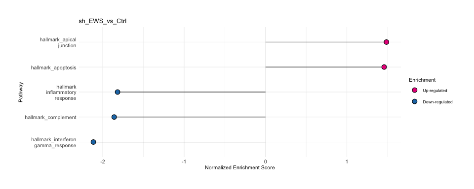
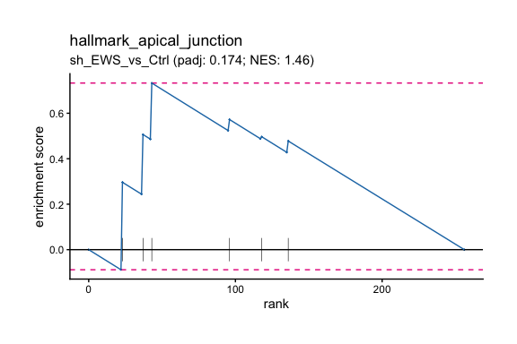

Visualization and Exploration
================

## Overview

This vignette demonstrates the visualization functions available in
Hotgenes. All examples use `fit_Hotgenes`, the pre-built limma-based
example object that ships with the package.

For details on creating Hotgenes objects, see **01 Creating Hotgenes
Objects**. For details on the API, see **02 API and Methods**.

``` r
library(Hotgenes)

fit_Hotgenes <- readRDS(
  system.file("extdata", "fit_Hotgenes.RDS",
              package = "Hotgenes",
              mustWork = TRUE)
)
```

------------------------------------------------------------------------

## 1. `DEPlot()` — Overview of All Contrasts

`DEPlot()` gives a bird’s-eye view of DE results across all contrasts in
the object. Each bar shows the number of significant features for one
contrast, split by direction (up / down).

``` r
DEPlot(fit_Hotgenes, .log2FoldChange = 0, padj_cut = 0.1)
```

<!-- -->

Pass a `hotList` to highlight specific features across contrasts:

``` r
DEPlot(fit_Hotgenes,
       hotList        = c("CSF1", "IL6"),
       .log2FoldChange = 0,
       padj_cut       = 0.1)
```

<!-- -->

------------------------------------------------------------------------

## 2. `VPlot()` — Volcano Plots

`VPlot()` renders a standard volcano plot for a single contrast. Points
are coloured by significance and fold-change. Labels are added for the
top hits (or for features in `hotList`).

``` r
VPlot(fit_Hotgenes,
      contrasts       = "sh_EWS_vs_Ctrl",
      .log2FoldChange = 1,
      padj_cut        = 0.1)
```

<!-- -->

Highlight a gene of interest with `hotList`:

``` r
VPlot(fit_Hotgenes,
      contrasts       = "sh_EWS_vs_Ctrl",
      .log2FoldChange = 1,
      padj_cut        = 0.1,
      point_label_size = 4,
      hotList         = "CXCL6",
      Hide_labels     = FALSE)
```

<!-- -->

------------------------------------------------------------------------

## 3. `Venn_Report()` — Overlapping Hits Across Contrasts

`Venn_Report()` identifies features that are significant in more than
one contrast (or contrast direction). It returns both a Venn diagram and
the underlying intersection tables.

Use `Report = "Features"` to overlap by feature name (ignoring
direction), or `Report = "contrast_dir"` to treat up- and down-regulated
hits as separate sets (maximum two contrasts).

``` r
# Overlapping features (ignoring direction) across three contrasts
venn_out <- fit_Hotgenes |>
  DE(
    Report   = "Features",
    contrasts = c("sh_EWS_vs_Ctrl", "Hrs_2_vs_0", "Hrs_6_vs_0"),
    padj_cut = 0.1
  ) |>
  Venn_Report(set_name_size = 4, stroke_size = 0.5, text_size = 4)
## Coordinate system already present.
## ℹ Adding new coordinate system, which will replace the existing one.

venn_out$vennD
```

<!-- -->

``` r
# Including directionality (up/down) for two contrasts
venn_dir_out <- fit_Hotgenes |>
  DE(
    Report   = "contrast_dir",
    contrasts = c("sh_EWS_vs_Ctrl", "Hrs_6_vs_0"),
    padj_cut = 0.1
  ) |>
  Venn_Report(set_name_size = 4)
## Coordinate system already present.
## ℹ Adding new coordinate system, which will replace the existing one.

venn_dir_out$vennD
```

<!-- -->

Retrieve the names and gene lists from the intersections:

``` r
# Names of features found in all intersecting sets
venn_out$Names
## [1] "Hrs_2_vs_0:Hrs_6_vs_0"                "sh_EWS_vs_Ctrl:Hrs_2_vs_0"           
## [3] "sh_EWS_vs_Ctrl:Hrs_6_vs_0"            "sh_EWS_vs_Ctrl:Hrs_2_vs_0:Hrs_6_vs_0"

# All intersection sets as a named list
venn_out$Intsect |> head()
## $Hrs_2_vs_0
## [1] "NFE2L2" "KEAP1"  "PDGFA"  "HDAC4"  "OXER1"  "GAPDH"  "MEF2C" 
## 
## $Hrs_6_vs_0
##  [1] "CXCL5"  "STAT2"  "NR3C1"  "MAP3K1" "HSPB2"  "MAPK8"  "DAXX"   "MKNK1"  "MAP2K6" "IL1B"   "BCL6"  
## [12] "TLR3"   "GRB2"   "IL6R"   "IL15"   "CREB1"  "IL1RN"  "RELA"   "IFIT3"  "MAP3K5" "TGFB3"  "TGFB2" 
## [23] "IL1A"   "CCL20"  "PGK1"   "MAPK3" 
## 
## $sh_EWS_vs_Ctrl
##  [1] "HIF1A"  "C3"     "RAC1"   "GNB1"   "TUBB"   "BCL2L1" "CSF1"   "PTGER3" "ROCK2"  "MX2"    "HMGN1" 
## [12] "CLTC"   "GNAQ"   "LY96"   "CD40"   "CFD"    "HRAS"   "RHOA"   "HPRT1"  "TCF4"   "MX1"    "OAS2"  
## [23] "LTB4R2"
## 
## $`Hrs_2_vs_0:Hrs_6_vs_0`
##  [1] "CXCL8"   "TNFAIP3" "CXCL1"   "IL11"    "PTGS2"   "DDIT3"   "IFIT2"   "TGFBR1"  "MAFF"    "CXCR4"  
## [11] "MAFK"    "PTGFR"   "FOS"     "MYC"     "RIPK2"   "IL2"     "MAFG"    "CSF2"    "TWIST2"  "IFIT1"  
## [21] "FLT1"   
## 
## $`sh_EWS_vs_Ctrl:Hrs_2_vs_0`
## [1] "HMGB2"  "MAP3K9" "CEBPB"  "IRF1"  
## 
## $`sh_EWS_vs_Ctrl:Hrs_6_vs_0`
##  [1] "C1R"   "C1S"   "MMP3"  "CXCL6" "STAT1" "PTGS1" "HMGB1" "MASP1" "TRAF2" "IFI44" "CCL7"
```

------------------------------------------------------------------------

## 4. `DEphe()` — Heatmap of Top Hits

`DEphe()` generates a pheatmap of the top `Topn` features for a selected
contrast, annotated with sample metadata.

``` r
DEphe(fit_Hotgenes,
      contrasts         = "sh_EWS_vs_Ctrl",
      Topn              = 5,
      cellheight        = 10,
      cellwidth         = 8,
      annotation_colors = coldata_palettes(fit_Hotgenes),
      annotations       = c("Hrs", "sh"))
```

Use `label_by` to replace the default Feature IDs with any alias column
in the mapper:

``` r
DEphe(fit_Hotgenes,
      contrasts         = "sh_EWS_vs_Ctrl",
      label_by          = "ensembl_id",
      Topn              = 5,
      cellheight        = 10,
      cellwidth         = 8,
      annotation_colors = coldata_palettes(fit_Hotgenes),
      annotations       = c("Hrs", "sh"))
```

Subset samples on the fly with `SampleIDs`:

``` r
selected_samples <- SampleIDs_(fit_Hotgenes)[1:8]

DEphe(fit_Hotgenes,
      contrasts         = "sh_EWS_vs_Ctrl",
      Topn              = 5,
      SampleIDs         = selected_samples,
      cellheight        = 10,
      cellwidth         = 8,
      annotation_colors = coldata_palettes(fit_Hotgenes),
      arrangeby         = c("Hrs", "sh"),
      annotations       = c("Hrs", "sh"))
```

------------------------------------------------------------------------

## 5. `ExpsPlot()` — Individual Gene Expression Plots

`ExpsPlot()` plots the expression trajectory for one or more features
across samples, coloured and faceted by metadata variables. Expression
data and coldata are joined automatically.

``` r
ExpsPlot(fit_Hotgenes,
         xVar    = "Hrs",
         yVar    = c("CXCL6", "IL6"),
         fill    = "Hrs",
         boxplot = TRUE)
```

<!-- -->

Filter samples on the fly with `filter_eval`:

``` r
ExpsPlot(fit_Hotgenes,
         xVar        = "Hrs",
         yVar        = c("CXCL6", "IL6"),
         fill        = "Hrs",
         boxplot     = TRUE,
         filter_eval = Hrs != 2)
```

<!-- -->

Reorder factor levels using `named_levels`:

``` r
ExpsPlot(fit_Hotgenes,
         xVar         = "Hrs",
         yVar         = c("CXCL6", "IL6"),
         boxplot      = TRUE,
         fill         = "Hrs",
         named_levels = list(Feature = "IL6",
                             Hrs     = c("6", "2", "0")))
```

<!-- -->

------------------------------------------------------------------------

## 6. `BoxPlot()` — Sample-level QC Plot

`BoxPlot()` renders a boxplot of expression values for each sample. It
is most useful for QC: checking normalization and identifying outlier
samples.

``` r
BoxPlot(fit_Hotgenes)
```

<!-- -->

Restrict to a subset of samples:

``` r
BoxPlot(fit_Hotgenes,
        SampleIDs = SampleIDs_(fit_Hotgenes)[1:6])
```

<!-- -->

------------------------------------------------------------------------

## 7. `FactoWrapper()` — PCA and Hierarchical Clustering

`FactoWrapper()` runs a full PCA via FactoMineR on the top features for
a given contrast, then clusters samples using HCPC (Hierarchical
Clustering on Principal Components).

``` r
FactoOutput <- FactoWrapper(
  fit_Hotgenes,
  contrasts   = "sh_EWS_vs_Ctrl",
  coldata_ids = c("Hrs", "sh"),
  biplot      = FALSE
)
## Appending TopTibble with available aliases: ensembl_id
```

``` r
FactoOutput$res_PPI_pa_1
```

<!-- -->

Inspect cluster assignments and top contributing features:

``` r
FactoOutput$TopTibble   # top features per cluster
## # A tibble: 66 × 10
##    Cluster Interpretation Feature v.test `Mean in category` `Overall mean` `sd in category` `Overall sd`
##    <fct>   <fct>          <chr>    <dbl>              <dbl>          <dbl>            <dbl>        <dbl>
##  1 1       Above average… IL1R1     2.35              12.1           11.6           0.0251        0.298 
##  2 1       Above average… IFI44     1.98               8.57           8.22          0.0245        0.263 
##  3 1       Below average… TRAF2    -2.09               9.20           9.59          0.00175       0.273 
##  4 1       Below average… JUN      -2.10              11.1           11.7           0.116         0.405 
##  5 1       Below average… CD40     -2.15               8.47           8.67          0.139         0.140 
##  6 1       Below average… CXCL2    -2.34               6.92           7.93          0.110         0.642 
##  7 1       Below average… MEF2D    -2.43              10.5           10.9           0.0225        0.231 
##  8 1       Below average… MEF2D    -2.43              10.5           10.9           0.0225        0.231 
##  9 1       Below average… MAP3K9   -2.55               4.52           5.68          0.0814        0.677 
## 10 1       Below average… MAPKAP…  -2.62              12.4           12.6           0.0394        0.0831
## # ℹ 56 more rows
## # ℹ 2 more variables: p.value <dbl>, ensembl_id <chr>
FactoOutput$TopGroups   # cluster membership per sample
## # A tibble: 2 × 8
##   Cluster Interpretation           Category `Cla/Mod` `Mod/Cla` Global p.value v.test
##   <fct>   <fct>                    <chr>        <dbl>     <dbl>  <dbl>   <dbl>  <dbl>
## 1 5       Above average in cluster sh=EWS        66.7       100     50  0.0303   2.17
## 2 5       Below average in cluster sh=Ctrl        0           0     50  0.0303  -2.17
```

------------------------------------------------------------------------

## 8. `coldata_palettes()` — Consistent Colour Schemes

`coldata_palettes()` generates a named list of colour vectors for each
factor in the coldata. This can be passed directly to `DEphe()` or used
in custom ggplot2 themes.

``` r
coldata_palettes(fit_Hotgenes)
## $sh
##        Ctrl         EWS 
## "lightgrey"     "black" 
## 
## $Bio_Rep
##           1           2 
## "lightgrey"     "black" 
## 
## $Hrs
##         0         2         6 
## "#1B9E77" "#D95F02" "#7570B3"
```

------------------------------------------------------------------------

## 9. Gene-set Enrichment with `msigdbr_wrapper()` and `fgsea_()`

### Built-in `msigdbr` gene sets

`msigdbr_wrapper()` returns a named list of gene sets sourced from
MSigDB via the `msigdbr` package.

``` r
H_paths <- msigdbr_wrapper(
  species  = "human",
  set      = c("H"),
  gene_col = "gene_symbol"
)

length(H_paths)
## [1] 50
H_paths |> names() |> head(5)
## [1] "hallmark_adipogenesis"        "hallmark_allograft_rejection" "hallmark_androgen_response"  
## [4] "hallmark_angiogenesis"        "hallmark_apical_junction"
```

### Running GSEA with `fgsea_()`

`fgsea_()` accepts ranked vectors returned by
`DE(..., Report = "Ranks")`.

``` r
InputRanks <- fit_Hotgenes |>
  DE(
    Report    = "Ranks",
    contrasts = "sh_EWS_vs_Ctrl",
    Rank_name = "Feature",
    padj_cut  = 1
  )

head(InputRanks)
## $sh_EWS_vs_Ctrl
##         MMP3        HMGB2        MEF2D        PTGS1          JUN        HMGB1         RAC1       MAP3K9 
##   9.23196931   8.63826832   6.91859713   6.55635291   6.05519763   5.63392842   5.34665347   5.22983101 
##         GNB1         TUBB       BCL2L1       PTGER3        BIRC2        ROCK2        CXCL3        HMGN1 
##   4.93340815   4.75746470   4.69675031   4.44199537   4.05478250   4.03982126   3.99791138   3.81714901 
##        MEF2A         CLTC         GNAQ        TRAF2         CD40        CXCL2         HRAS        HPRT1 
##   3.53935236   3.28231690   3.25811676   3.22697764   3.15857799   2.99626024   2.92880736   2.88052300 
##        SMAD7         RHOA         TCF4     MAPKAPK2       LTB4R2         IL18        RIPK2        PLCB1 
##   2.84888019   2.84571370   2.73163608   2.72155543   2.54990152   2.43811463   2.34153355   2.29249232 
##         RAF1       MAP3K5        HSPB2        C3AR1         SHC1         FLT1        MAPK1        PRKCA 
##   2.21308496   2.10088683   2.06498990   2.04691182   1.99753727   1.99178517   1.97835698   1.97268600 
##         AGER         BCL6       MAPK14        NR3C1       ALOX12         CCR3       MAP2K1         RELA 
##   1.91980175   1.88135779   1.87734699   1.87308583   1.81846355   1.76542547   1.75116207   1.74003567 
##        MAPK8         CSF2        MEF2C        PTGS2      RPS6KA5         NOD1        CCL16      TNFAIP3 
##   1.70248065   1.69619991   1.66302886   1.65918469   1.57702114   1.57475870   1.52998464   1.52016828 
##         KNG1          IL7        HDAC4         CFL1        IL1RN         GNAS       MAP2K6           C9 
##   1.45713906   1.37151983   1.36197518   1.35910547   1.28807643   1.13923758   1.13682039   1.11379029 
##        TGFB1        CXCR4         TLR9       NFATC3       PTGER4        CREB1        PRKCB        PDGFA 
##   1.10907917   1.08688136   1.04211822   0.99403714   0.96579934   0.92827009   0.90364739   0.88111963 
##          IL5        CCL11         IL13        CCL23       TBXA2R        CXCR1          IL9          MYC 
##   0.85638689   0.83872011   0.83608986   0.78379499   0.78371335   0.73907642   0.68440559   0.68283007 
##        CDC42          CD4        IFNA1         MAFF         CSF3           C5       MAP3K7         C1QA 
##   0.64149979   0.63458716   0.63349190   0.63345455   0.61981183   0.58409989   0.57212744   0.57136316 
##         IL21          TNF        IFNB1       TOLLIP         IL10         IRF5         CCR4         CD86 
##   0.56323090   0.56185131   0.55960333   0.53718110   0.52533802   0.50062435   0.39346853   0.36857620 
##         PGK1        ITGB2       PTGER2      CYSLTR1       PTGER1         TSLP         CCR2        FXYD2 
##   0.35051302   0.34742610   0.32246173   0.29637546   0.27127102   0.26369319   0.25680206   0.24915511 
##        LIMK1         IL1B        GAPDH         TLR5          IL3           C7         GUSB        KEAP1 
##   0.22882858   0.21907742   0.20411311   0.18423028   0.17969763   0.14711371   0.14167607   0.12396588 
##         MAFG        LTB4R         AREG        GNGT1          C8A         PTK2        IL12A         OASL 
##   0.11430101   0.10602917   0.08918235   0.07272003   0.06829105   0.06355101   0.03876954   0.03663648 
##        OXER1         CCR7       CXCL10         MRC1         ATF2        TREM2        TGFB3        CXCR2 
##   0.01481433  -0.04508789  -0.05451975  -0.08015497  -0.09419450  -0.11124414  -0.11444802  -0.17076714 
##        CXCL8         NOS2      IL22RA2         ELK1        HSPB1        TGFB2          C4A         MMP9 
##  -0.18936019  -0.20298377  -0.21307741  -0.22752012  -0.24608467  -0.25794332  -0.31284137  -0.37912828 
##       MAP2K4           C2         IRF3          CRP       TYROBP        ALOX5     PPP1R12B      CYSLTR2 
##  -0.46437909  -0.48184256  -0.48844459  -0.49206283  -0.52135089  -0.56020537  -0.57878816  -0.63191174 
##         CCL8        IL12B        MYD88         MYL2        FASLG        CXCL5       ALOX15        CCL20 
##  -0.63357891  -0.64198240  -0.65038405  -0.66616429  -0.66761332  -0.66884649  -0.67378904  -0.70258198 
##        NLRP3         IL15         DAXX         IL22         MAFK        IL23R         GRB2          FOS 
##  -0.70696634  -0.71178944  -0.71290303  -0.73049341  -0.73646359  -0.73752846  -0.73811230  -0.74235993 
##       IL1RAP         CCL4         C1QB         ARG1        IFIT3       TWIST2       TGFBR1      HLA-DRA 
##  -0.80163491  -0.80245589  -0.80999697  -0.84137555  -0.84535559  -0.84602905  -0.85655367  -0.85924057 
##         CCL3          C8B        IL23A         NOX1         MBL2        RIPK1         IL11        CCL21 
##  -0.87792208  -0.90576344  -0.90860054  -0.91454048  -0.91689183  -0.94899158  -0.95395457  -0.98968590 
##       PTGDR2      PIK3C2G           C6        CCL24       CD40LG        CD163        CCL17        PTGFR 
##  -0.99050188  -1.00519745  -1.01649649  -1.03806427  -1.07576140  -1.08307756  -1.08502447  -1.09841469 
##        DDIT3     MAPKAPK5      PLA2G4A          LTB        MASP2        CCL13         TLR3        IFIT1 
##  -1.10025860  -1.10643401  -1.10773788  -1.11457576  -1.12837981  -1.12849322  -1.16468731  -1.17471821 
##       NFE2L2        CCL22     HLA-DRB1       MAP3K1        IL17A        TRADD          LTA      IL18RAP 
##  -1.18422620  -1.19042278  -1.19395048  -1.23714807  -1.29525695  -1.34336734  -1.36731548  -1.46906485 
##      RAPGEF2        STAT3        DEFA1        CXCL9         TLR4 BORCS8-MEF2B      TNFSF14         NOD2 
##  -1.49059634  -1.56494743  -1.61268606  -1.61341813  -1.69536667  -1.69979746  -1.76729005  -1.84041264 
##         CCL5         TLR2         IL6R          IL2         TLR1         IL1A         CD55          MAX 
##  -1.86370115  -1.86684727  -1.89635505  -1.90345655  -1.90718059  -1.94654165  -1.96167937  -1.99302345 
##          IL4         CCR1        IFIT2         IFNG        MAPK3       IL10RB        CCL19        STAT2 
##  -1.99733859  -2.02165377  -2.02397947  -2.03671124  -2.07009927  -2.08532800  -2.08885030  -2.12890080 
##        PTGIR          CFB         IRF7         TLR8         TLR7         TLR6        HSH2D        CXCL1 
##  -2.13014814  -2.13209391  -2.15587530  -2.17897238  -2.21150790  -2.25866406  -2.28351885  -2.34192970 
##        MKNK1         RELB         OAS2          MX1        NFKB1         IRF1          IL6         CCL7 
##  -2.43354751  -2.51879480  -2.62802391  -2.68294859  -2.84916512  -2.84978596  -2.92081969  -2.94422937 
##        IFI44          CFD         LY96          MX2        CEBPB        MASP1         CSF1           C3 
##  -3.06755028  -3.13692189  -3.22665502  -3.93543312  -4.55119889  -4.56206849  -4.66393919  -6.29401804 
##        HIF1A        STAT1        IL1R1        CXCL6          C1S         CCL2          C1R 
##  -7.17057201  -7.55684379  -7.99412875  -8.77610451 -12.28407654 -15.82342065 -16.73515625
```

``` r
Out_GSEA <- fgsea_(
  Ranks    = InputRanks,
  pathways = H_paths,
  nproc    = 1,
  minSize  = 5,
  maxSize  = Inf
)
##   |                                                                                                      |                                                                                              |   0%  |                                                                                                      |===================                                                                           |  20%  |                                                                                                      |======================================                                                        |  40%  |                                                                                                      |========================================================                                      |  60%  |                                                                                                      |===========================================================================                   |  80%  |                                                                                                      |==============================================================================================| 100%
```

### Inspecting GSEA results

``` r
Out_GSEA |>
  fgsea_Results(
    contrasts = "sh_EWS_vs_Ctrl",
    padj_cut  = 0.2,
    mode      = "D"
  ) |> head()
## $sh_EWS_vs_Ctrl
## # A tibble: 8 × 9
##   pathway                                 pval     padj log2err     ES   NES  size leadingEdge sign_NES
##   <chr>                                  <dbl>    <dbl>   <dbl>  <dbl> <dbl> <int> <list>         <dbl>
## 1 hallmark_apical_junction           0.0546    0.174      0.266  0.733  1.46     6 <chr [3]>          1
## 2 hallmark_apoptosis                 0.0604    0.174      0.262  0.548  1.46    17 <chr [5]>          1
## 3 hallmark_il6_jak_stat3_signaling   0.0550    0.174      0.266 -0.530 -1.46    24 <chr [13]>        -1
## 4 hallmark_allograft_rejection       0.0149    0.0685     0.381 -0.474 -1.55    54 <chr [22]>        -1
## 5 hallmark_interferon_alpha_response 0.00375   0.0215     0.432 -0.736 -1.75    14 <chr [8]>         -1
## 6 hallmark_inflammatory_response     0.000771  0.00806    0.477 -0.580 -1.81    43 <chr [20]>        -1
## 7 hallmark_complement                0.00105   0.00806    0.455 -0.708 -1.85    20 <chr [9]>         -1
## 8 hallmark_interferon_gamma_response 0.0000120 0.000277   0.593 -0.700 -2.14    37 <chr [16]>        -1
```

``` r
Out_GSEA |>
  fgsea_Results(
    contrasts = "sh_EWS_vs_Ctrl",
    padj_cut  = 0.2,
    mode      = "leadingEdge"
  ) |> head()
## $sh_EWS_vs_Ctrl
## $sh_EWS_vs_Ctrl$hallmark_apical_junction
## [1] "HRAS"   "SHC1"   "MAPK14"
## 
## $sh_EWS_vs_Ctrl$hallmark_apoptosis
## [1] "HMGB2"  "JUN"    "BCL2L1" "SMAD7"  "IL18"  
## 
## $sh_EWS_vs_Ctrl$hallmark_il6_jak_stat3_signaling
##  [1] "IL1R1"  "STAT1"  "CSF1"   "CCL7"   "IL6"    "IRF1"   "CXCL1"  "STAT2"  "IL10RB" "CCR1"   "TLR2"  
## [12] "CXCL9"  "STAT3" 
## 
## $sh_EWS_vs_Ctrl$hallmark_allograft_rejection
##  [1] "CCL2"    "STAT1"   "HIF1A"   "CSF1"    "CCL7"    "IL6"     "TLR6"    "IRF7"    "CCL19"   "IFNG"   
## [11] "CCR1"    "IL4"     "TLR1"    "IL2"     "TLR2"    "CCL5"    "CXCL9"   "IL18RAP" "CCL22"   "TLR3"   
## [21] "CCL13"   "LTB"    
## 
## $sh_EWS_vs_Ctrl$hallmark_interferon_alpha_response
## [1] "C1S"   "CSF1"  "IFI44" "IRF1"  "MX1"   "IRF7"  "STAT2" "IFIT2"
## 
## $sh_EWS_vs_Ctrl$hallmark_inflammatory_response
##  [1] "CCL2"    "CXCL6"   "IL1R1"   "HIF1A"   "CSF1"    "CCL7"    "IL6"     "IRF1"    "NFKB1"   "IRF7"   
## [11] "PTGIR"   "CD55"    "IL1A"    "TLR1"    "TLR2"    "CCL5"    "NOD2"    "CXCL9"   "IL18RAP" "LTA"    
## 
## $sh_EWS_vs_Ctrl$hallmark_complement
## [1] "C1R"   "C1S"   "C3"    "CEBPB" "IL6"   "IRF1"  "CXCL1" "IRF7"  "CFB"  
## 
## $sh_EWS_vs_Ctrl$hallmark_interferon_gamma_response
##  [1] "C1R"   "CCL2"  "C1S"   "STAT1" "HIF1A" "MX2"   "IFI44" "CCL7"  "IL6"   "IRF1"  "NFKB1" "MX1"  
## [13] "OAS2"  "IRF7"  "CFB"   "STAT2"
```

### Visualizing GSEA results

``` r
Out_GSEA |>
  GSEA_Plots(
    contrasts = "sh_EWS_vs_Ctrl",
    padj_cut  = 0.2,
    Topn      = 3,
    width     = 20
  )
## $sh_EWS_vs_Ctrl
```

<!-- -->

``` r
sig_paths <- Out_GSEA |>
  fgsea_Results(
    contrasts = "sh_EWS_vs_Ctrl",
    padj_cut  = 0.2,
    mode      = "D"
  )

if (nrow(sig_paths$sh_EWS_vs_Ctrl) > 0) {
  first_geneset_name <- sig_paths$sh_EWS_vs_Ctrl$pathway[1]

  plotEnrichment_(
    fgseaRes    = Out_GSEA,
    contrast    = "sh_EWS_vs_Ctrl",
    genesetName = first_geneset_name
  )
}
## Leading edge genes for hallmark_apical_junction:
## ℹ HRAS, SHC1, MAPK14
```

<!-- -->

``` r
if (nrow(sig_paths$sh_EWS_vs_Ctrl) > 0) {
  first_geneset_name <- sig_paths$sh_EWS_vs_Ctrl$pathway[1]

  leadingGenes(
    fgseaRes    = Out_GSEA,
    contrast    = "sh_EWS_vs_Ctrl",
    genesetName = first_geneset_name
  )
}
## [1] "HRAS"   "SHC1"   "MAPK14"
```

------------------------------------------------------------------------

## 10. Custom Gene Set Configuration (Non-Shiny)

`OntologyMethods()` and `OntologyFunctions()` can define and retrieve
custom gene-set sources independently of the Shiny app.

``` r
Custom_db <- OntologyMethods(
  Ontology_Function = list("msigdbr" = msigdbr_wrapper),
  InputChoices = list("msigdbr" = c("CP:REACTOME", "CP:KEGG", "H")),
  gene_col_choices = list("msigdbr" = c(
    "gene_symbol", "entrez_gene", "ensembl_gene"
  )),
  species_choices = list("msigdbr" = c("human", "mouse", "rat")),
  versions = list("msigdbr" = packageVersion("msigdbr"))
)

custom_paths <- OntologyFunctions(
  Methods  = Custom_db,
  db       = "msigdbr",
  species  = "human",
  set      = c("CP:REACTOME", "CP:KEGG"),
  gene_col = "gene_symbol"
)

length(custom_paths)
## [1] 1787
names(custom_paths)[1:5]
## [1] "reactome_2_ltr_circle_formation"                                         
## [2] "reactome_a_tetrasaccharide_linker_sequence_is_required_for_gag_synthesis"
## [3] "reactome_abacavir_adme"                                                  
## [4] "reactome_abacavir_transmembrane_transport"                               
## [5] "reactome_abc_family_proteins_mediated_transport"
```

`custom_paths` can be passed directly to `fgsea_()` or `HotgeneSets()`
in downstream enrichment and pathway activity workflows.

------------------------------------------------------------------------

## Summary of Visualization Functions

| Function | Purpose |
|----|----|
| `DEPlot()` | Bar chart of DE counts across all contrasts |
| `VPlot()` | Volcano plot for a single contrast |
| `Venn_Report()` | Venn diagram of overlapping features |
| `DEphe()` | Heatmap of top hits for a contrast |
| `ExpsPlot()` | Expression trajectory plots |
| `BoxPlot()` | Sample-level expression boxplots (QC) |
| `FactoWrapper()` | PCA + HCPC clustering |
| `coldata_palettes()` | Colour palettes for metadata factors |
| `msigdbr_wrapper()` | Retrieve MSigDB gene sets for enrichment |
| `fgsea_()` | Run GSEA from ranked DE vectors |
| `fgsea_Results()` | Extract enrichment tables or leading-edge genes |
| `GSEA_Plots()` | Plot top enriched pathways |
| `plotEnrichment_()` | Plot one pathway enrichment curve |
| `leadingGenes()` | Return leading-edge genes for one pathway |
| `OntologyMethods()` / `OntologyFunctions()` | Configure and retrieve custom gene-set sources |
