Visualization and Exploration
================

## Overview

This vignette demonstrates the visualization functions available in
Hotgenes. All examples use `fit_Hotgenes`, the pre-built limma-based
example object that ships with the package.

For details on creating Hotgenes objects, see **01 Creating Hotgenes
Objects**. For details on the API, see **02 API and Methods**.

``` r
library(Hotgenes)

fit_Hotgenes <- readRDS(
  system.file("extdata", "fit_Hotgenes.RDS",
              package = "Hotgenes",
              mustWork = TRUE)
)
```

------------------------------------------------------------------------

## 1. `DEPlot()` — Overview of All Contrasts

`DEPlot()` gives a bird’s-eye view of DE results across all contrasts in
the object. Each bar shows the number of significant features for one
contrast, split by direction (up / down).

``` r
DEPlot(fit_Hotgenes, .log2FoldChange = 0, padj_cut = 0.1)
```

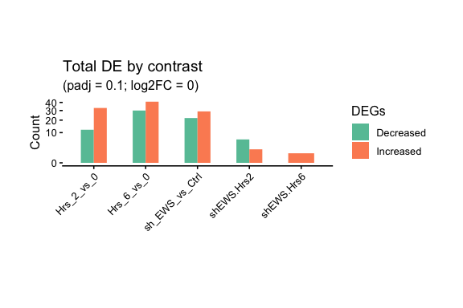<!-- -->

Pass a `hotList` to highlight specific features across contrasts:

``` r
DEPlot(fit_Hotgenes,
       hotList        = c("CSF1", "IL6"),
       .log2FoldChange = 0,
       padj_cut       = 0.1)
```

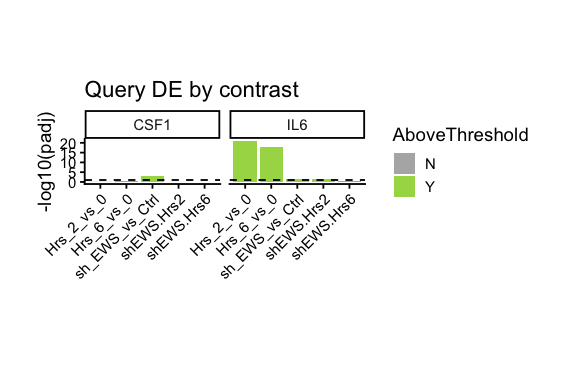<!-- -->

------------------------------------------------------------------------

## 2. `VPlot()` — Volcano Plots

`VPlot()` renders a standard volcano plot for a single contrast. Points
are coloured by significance and fold-change. Labels are added for the
top hits (or for features in `hotList`).

``` r
VPlot(fit_Hotgenes,
      contrasts       = "sh_EWS_vs_Ctrl",
      .log2FoldChange = 1,
      padj_cut        = 0.1)
```

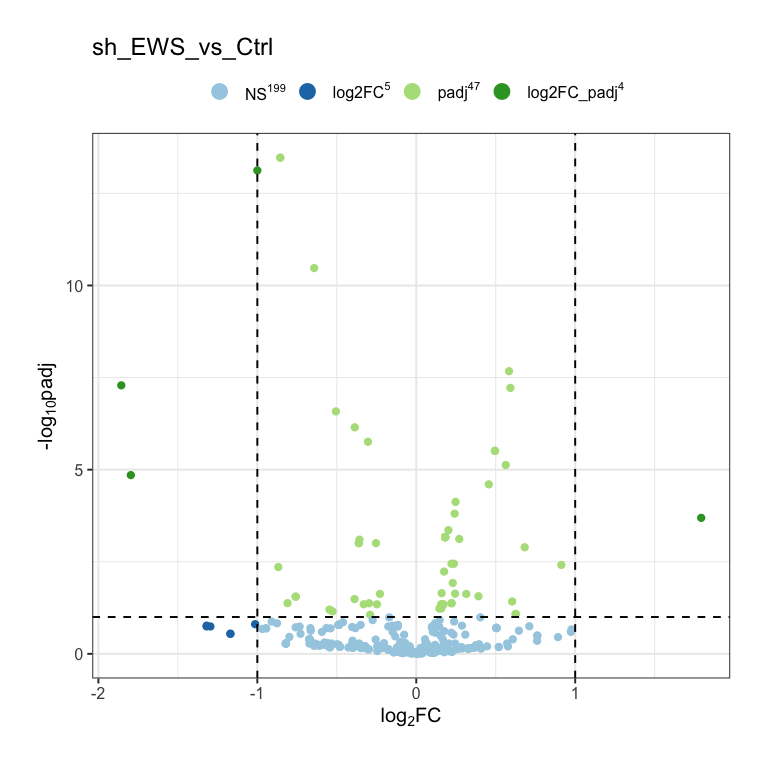<!-- -->

Highlight a gene of interest with `hotList`:

``` r
VPlot(fit_Hotgenes,
      contrasts       = "sh_EWS_vs_Ctrl",
      .log2FoldChange = 1,
      padj_cut        = 0.1,
      point_label_size = 4,
      hotList         = "CXCL6",
      Hide_labels     = FALSE)
```

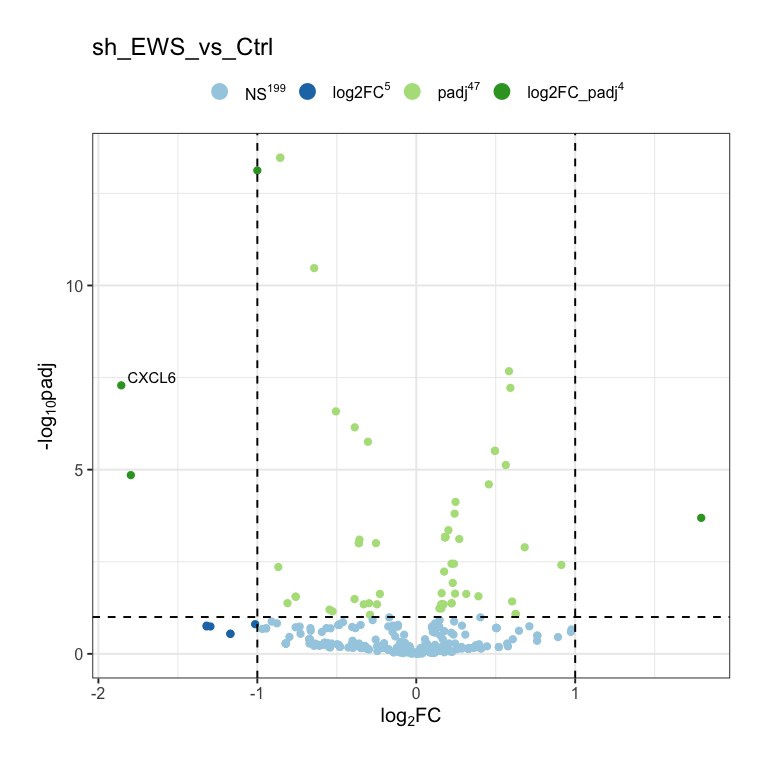<!-- -->

------------------------------------------------------------------------

## 3. `Venn_Report()` — Overlapping Hits Across Contrasts

`Venn_Report()` identifies features that are significant in more than
one contrast (or contrast direction). It returns both a Venn diagram and
the underlying intersection tables.

Use `Report = "Features"` to overlap by feature name (ignoring
direction), or `Report = "contrast_dir"` to treat up- and down-regulated
hits as separate sets (maximum two contrasts).

``` r
# Overlapping features (ignoring direction) across three contrasts
venn_out <- fit_Hotgenes |>
  DE(
    Report   = "Features",
    contrasts = c("sh_EWS_vs_Ctrl", "Hrs_2_vs_0", "Hrs_6_vs_0"),
    padj_cut = 0.1
  ) |>
  Venn_Report(set_name_size = 4, stroke_size = 0.5, text_size = 4)
## Coordinate system already present.
## ℹ Adding new coordinate system, which will replace the existing one.

venn_out$vennD
```

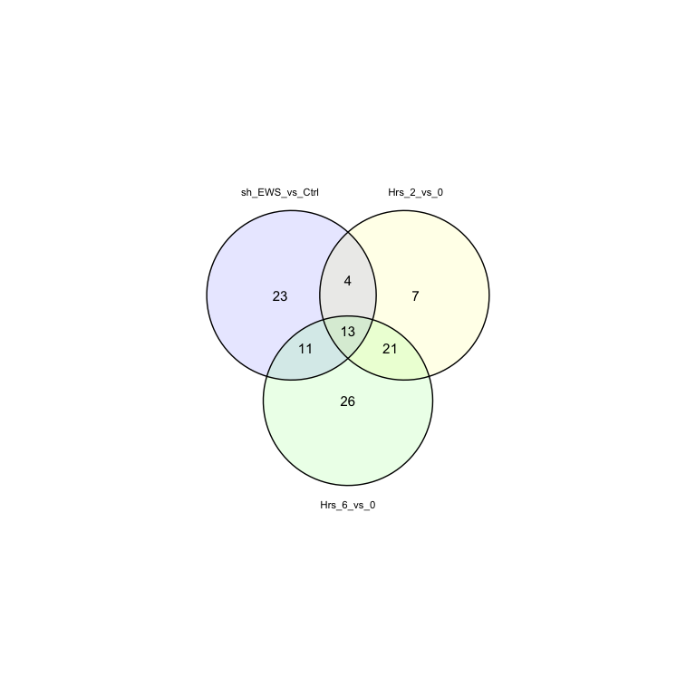<!-- -->

``` r
# Including directionality (up/down) for two contrasts
venn_dir_out <- fit_Hotgenes |>
  DE(
    Report   = "contrast_dir",
    contrasts = c("sh_EWS_vs_Ctrl", "Hrs_6_vs_0"),
    padj_cut = 0.1
  ) |>
  Venn_Report(set_name_size = 4)
## Coordinate system already present.
## ℹ Adding new coordinate system, which will replace the existing one.

venn_dir_out$vennD
```

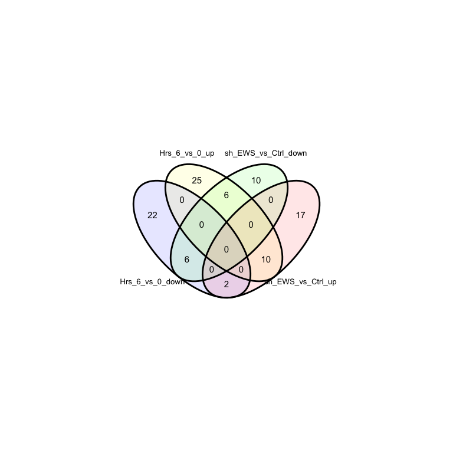<!-- -->

Retrieve the names and gene lists from the intersections:

``` r
# Names of features found in all intersecting sets
venn_out$Names
## [1] "Hrs_2_vs_0:Hrs_6_vs_0"                "sh_EWS_vs_Ctrl:Hrs_2_vs_0"           
## [3] "sh_EWS_vs_Ctrl:Hrs_6_vs_0"            "sh_EWS_vs_Ctrl:Hrs_2_vs_0:Hrs_6_vs_0"

# All intersection sets as a named list
venn_out$Intsect |> head()
## $Hrs_2_vs_0
## [1] "NFE2L2" "KEAP1"  "PDGFA"  "HDAC4"  "OXER1"  "GAPDH"  "MEF2C" 
## 
## $Hrs_6_vs_0
##  [1] "CXCL5"  "STAT2"  "NR3C1"  "MAP3K1" "HSPB2"  "MAPK8"  "DAXX"   "MKNK1"  "MAP2K6"
## [10] "IL1B"   "BCL6"   "TLR3"   "GRB2"   "IL6R"   "IL15"   "CREB1"  "IL1RN"  "RELA"  
## [19] "IFIT3"  "MAP3K5" "TGFB3"  "TGFB2"  "IL1A"   "CCL20"  "PGK1"   "MAPK3" 
## 
## $sh_EWS_vs_Ctrl
##  [1] "HIF1A"  "C3"     "RAC1"   "GNB1"   "TUBB"   "BCL2L1" "CSF1"   "PTGER3" "ROCK2" 
## [10] "MX2"    "HMGN1"  "CLTC"   "GNAQ"   "LY96"   "CD40"   "CFD"    "HRAS"   "RHOA"  
## [19] "HPRT1"  "TCF4"   "MX1"    "OAS2"   "LTB4R2"
## 
## $`Hrs_2_vs_0:Hrs_6_vs_0`
##  [1] "CXCL8"   "TNFAIP3" "CXCL1"   "IL11"    "PTGS2"   "DDIT3"   "IFIT2"   "TGFBR1" 
##  [9] "MAFF"    "CXCR4"   "MAFK"    "PTGFR"   "FOS"     "MYC"     "RIPK2"   "IL2"    
## [17] "MAFG"    "CSF2"    "TWIST2"  "IFIT1"   "FLT1"   
## 
## $`sh_EWS_vs_Ctrl:Hrs_2_vs_0`
## [1] "HMGB2"  "MAP3K9" "CEBPB"  "IRF1"  
## 
## $`sh_EWS_vs_Ctrl:Hrs_6_vs_0`
##  [1] "C1R"   "C1S"   "MMP3"  "CXCL6" "STAT1" "PTGS1" "HMGB1" "MASP1" "TRAF2" "IFI44"
## [11] "CCL7"
```

------------------------------------------------------------------------

## 4. `DEphe()` — Heatmap of Top Hits

`DEphe()` generates a pheatmap of the top `Topn` features for a selected
contrast, annotated with sample metadata.

``` r
DEphe(fit_Hotgenes,
      contrasts         = "sh_EWS_vs_Ctrl",
      Topn              = 5,
      cellheight        = 10,
      cellwidth         = 8,
      annotation_colors = coldata_palettes(fit_Hotgenes),
      annotations       = c("Hrs", "sh"))
```

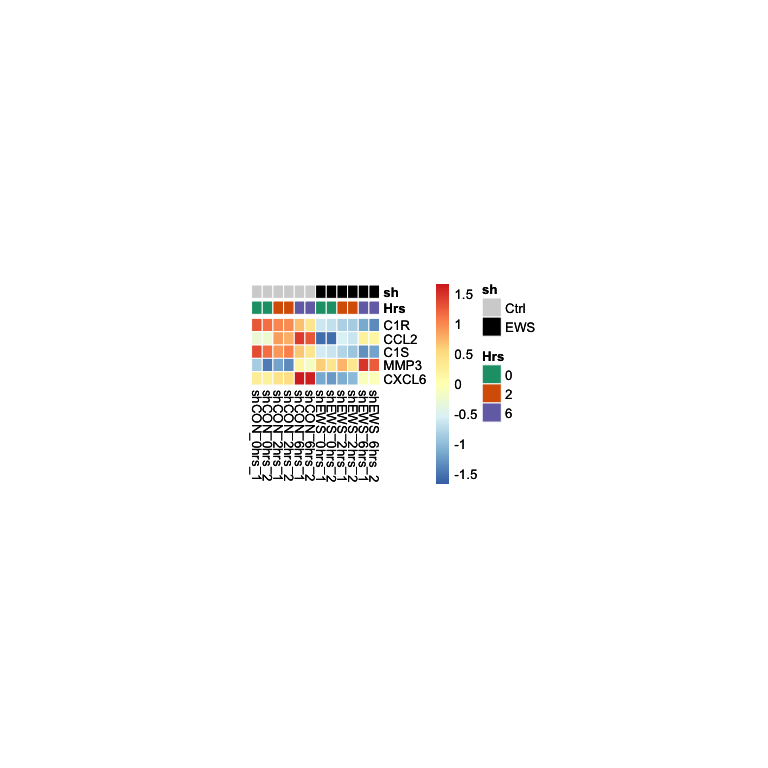<!-- -->

Use `label_by` to replace the default Feature IDs with any alias column
in the mapper:

``` r
DEphe(fit_Hotgenes,
      contrasts         = "sh_EWS_vs_Ctrl",
      label_by          = "ensembl_id",
      Topn              = 5,
      cellheight        = 10,
      cellwidth         = 8,
      annotation_colors = coldata_palettes(fit_Hotgenes),
      annotations       = c("Hrs", "sh"))
```

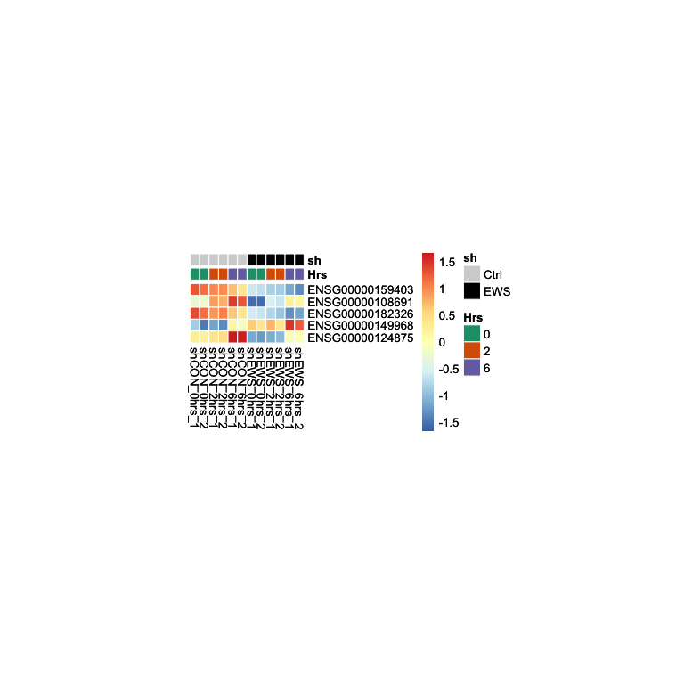<!-- -->

Subset samples on the fly with `SampleIDs`:

``` r
selected_samples <- SampleIDs_(fit_Hotgenes)[1:8]

DEphe(fit_Hotgenes,
      contrasts         = "sh_EWS_vs_Ctrl",
      Topn              = 5,
      SampleIDs         = selected_samples,
      cellheight        = 10,
      cellwidth         = 8,
      annotation_colors = coldata_palettes(fit_Hotgenes),
      arrangeby         = c("Hrs", "sh"),
      annotations       = c("Hrs", "sh"))
```

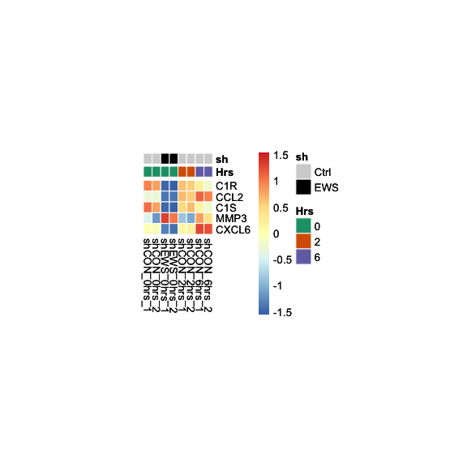<!-- -->

------------------------------------------------------------------------

## 5. `ExpsPlot()` — Individual Gene Expression Plots

`ExpsPlot()` plots the expression trajectory for one or more features
across samples, coloured and faceted by metadata variables. Expression
data and coldata are joined automatically.

``` r
ExpsPlot(fit_Hotgenes,
         xVar    = "Hrs",
         yVar    = c("CXCL6", "IL6"),
         fill    = "Hrs",
         boxplot = TRUE)
```

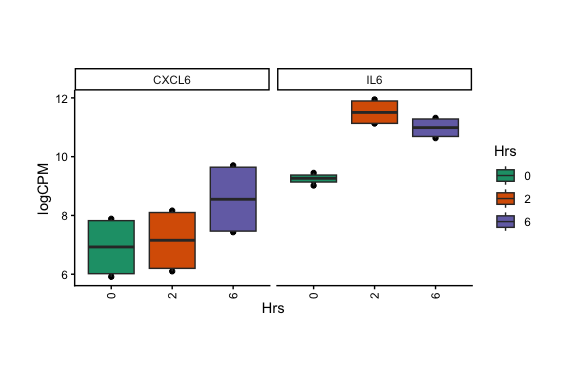<!-- -->

Filter samples on the fly with `filter_eval`:

``` r
ExpsPlot(fit_Hotgenes,
         xVar        = "Hrs",
         yVar        = c("CXCL6", "IL6"),
         fill        = "Hrs",
         boxplot     = TRUE,
         filter_eval = Hrs != 2)
```

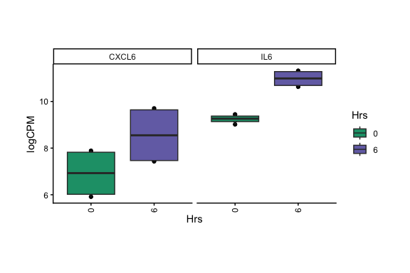<!-- -->

Reorder factor levels using `named_levels`:

``` r
ExpsPlot(fit_Hotgenes,
         xVar         = "Hrs",
         yVar         = c("CXCL6", "IL6"),
         boxplot      = TRUE,
         fill         = "Hrs",
         named_levels = list(Feature = "IL6",
                             Hrs     = c("6", "2", "0")))
```

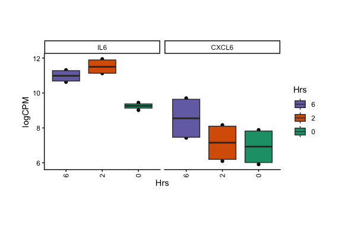<!-- -->

------------------------------------------------------------------------

## 6. `BoxPlot()` — Sample-level QC Plot

`BoxPlot()` renders a boxplot of expression values for each sample. It
is most useful for QC: checking normalization and identifying outlier
samples.

``` r
BoxPlot(fit_Hotgenes)
```

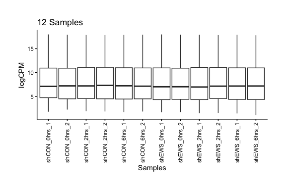<!-- -->

Restrict to a subset of samples:

``` r
BoxPlot(fit_Hotgenes,
        SampleIDs = SampleIDs_(fit_Hotgenes)[1:6])
```

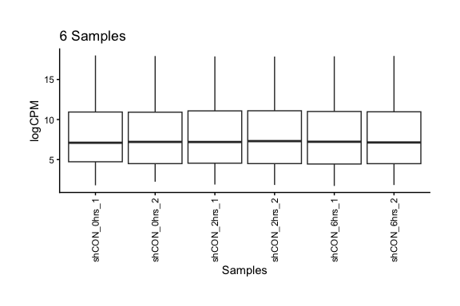<!-- -->

------------------------------------------------------------------------

## 7. `FactoWrapper()` — PCA and Hierarchical Clustering

`FactoWrapper()` runs a full PCA via FactoMineR on the top features for
a given contrast, then clusters samples using HCPC (Hierarchical
Clustering on Principal Components).

``` r
FactoOutput <- FactoWrapper(
  fit_Hotgenes,
  contrasts   = "sh_EWS_vs_Ctrl",
  coldata_ids = c("Hrs", "sh"),
  biplot      = FALSE
)
## Appending TopTibble with available aliases: ensembl_id
```

``` r
FactoOutput$res_PPI_pa_1
```

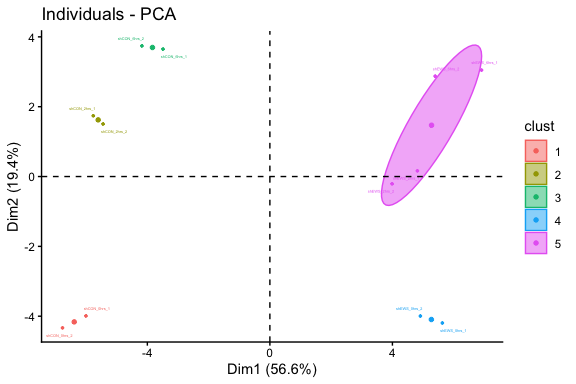<!-- -->

Inspect cluster assignments and top contributing features:

``` r
FactoOutput$TopTibble   # top features per cluster
## # A tibble: 66 × 10
##    Cluster Interpretation           Feature  v.test `Mean in category` `Overall mean`
##    <fct>   <fct>                    <chr>     <dbl>              <dbl>          <dbl>
##  1 1       Above average in cluster IL1R1      2.35              12.1           11.6 
##  2 1       Above average in cluster IFI44      1.98               8.57           8.22
##  3 1       Below average in cluster TRAF2     -2.09               9.20           9.59
##  4 1       Below average in cluster JUN       -2.10              11.1           11.7 
##  5 1       Below average in cluster CD40      -2.15               8.47           8.67
##  6 1       Below average in cluster CXCL2     -2.34               6.92           7.93
##  7 1       Below average in cluster MEF2D     -2.43              10.5           10.9 
##  8 1       Below average in cluster MEF2D     -2.43              10.5           10.9 
##  9 1       Below average in cluster MAP3K9    -2.55               4.52           5.68
## 10 1       Below average in cluster MAPKAPK2  -2.62              12.4           12.6 
## # ℹ 56 more rows
## # ℹ 4 more variables: `sd in category` <dbl>, `Overall sd` <dbl>, p.value <dbl>,
## #   ensembl_id <chr>
FactoOutput$TopGroups   # cluster membership per sample
## # A tibble: 2 × 8
##   Cluster Interpretation           Category `Cla/Mod` `Mod/Cla` Global p.value v.test
##   <fct>   <fct>                    <chr>        <dbl>     <dbl>  <dbl>   <dbl>  <dbl>
## 1 5       Above average in cluster sh=EWS        66.7       100     50  0.0303   2.17
## 2 5       Below average in cluster sh=Ctrl        0           0     50  0.0303  -2.17
```

------------------------------------------------------------------------

## 8. `coldata_palettes()` — Consistent Colour Schemes

`coldata_palettes()` generates a named list of colour vectors for each
factor in the coldata. This can be passed directly to `DEphe()` or used
in custom ggplot2 themes.

``` r
coldata_palettes(fit_Hotgenes)
## $sh
##        Ctrl         EWS 
## "lightgrey"     "black" 
## 
## $Bio_Rep
##           1           2 
## "lightgrey"     "black" 
## 
## $Hrs
##         0         2         6 
## "#1B9E77" "#D95F02" "#7570B3"
```

------------------------------------------------------------------------

## 9. Gene-set Enrichment with `msigdbr_wrapper()` and `fgsea_()`

### Built-in `msigdbr` gene sets

`msigdbr_wrapper()` returns a named list of gene sets sourced from
MSigDB via the `msigdbr` package.

``` r
H_paths <- msigdbr_wrapper(
  species  = "human",
  set      = c("H"),
  gene_col = "gene_symbol"
)

length(H_paths)
H_paths |> names() |> head(5)
```

### Running GSEA with `fgsea_()`

`fgsea_()` accepts ranked vectors returned by
`DE(..., Report = "Ranks")`.

``` r
InputRanks <- fit_Hotgenes |>
  DE(
    Report    = "Ranks",
    contrasts = "sh_EWS_vs_Ctrl",
    Rank_name = "Feature",
    padj_cut  = 1
  )

head(InputRanks)
```

``` r
Out_GSEA <- fgsea_(
  Ranks    = InputRanks,
  pathways = H_paths,
  nproc    = 1,
  minSize  = 5,
  maxSize  = Inf
)
```

### Inspecting GSEA results

``` r
Out_GSEA |>
  fgsea_Results(
    contrasts = "sh_EWS_vs_Ctrl",
    padj_cut  = 0.2,
    mode      = "D"
  ) |> head()
```

``` r
Out_GSEA |>
  fgsea_Results(
    contrasts = "sh_EWS_vs_Ctrl",
    padj_cut  = 0.2,
    mode      = "leadingEdge"
  ) |> head()
```

### Visualizing GSEA results

``` r
Out_GSEA |>
  GSEA_Plots(
    contrasts = "sh_EWS_vs_Ctrl",
    padj_cut  = 0.2,
    Topn      = 3,
    width     = 20
  )
```

``` r
sig_paths <- Out_GSEA |>
  fgsea_Results(
    contrasts = "sh_EWS_vs_Ctrl",
    padj_cut  = 0.2,
    mode      = "D"
  )

if (nrow(sig_paths$sh_EWS_vs_Ctrl) > 0) {
  first_geneset_name <- sig_paths$sh_EWS_vs_Ctrl$pathway[1]

  plotEnrichment_(
    fgseaRes    = Out_GSEA,
    contrast    = "sh_EWS_vs_Ctrl",
    genesetName = first_geneset_name
  )
}
```

``` r
if (nrow(sig_paths$sh_EWS_vs_Ctrl) > 0) {
  first_geneset_name <- sig_paths$sh_EWS_vs_Ctrl$pathway[1]

  leadingGenes(
    fgseaRes    = Out_GSEA,
    contrast    = "sh_EWS_vs_Ctrl",
    genesetName = first_geneset_name
  )
}
```

------------------------------------------------------------------------

## 10. Custom Gene Set Configuration (Non-Shiny)

`OntologyMethods()` and `OntologyFunctions()` can define and retrieve
custom gene-set sources independently of the Shiny app.

``` r
Custom_db <- OntologyMethods(
  Ontology_Function = list("msigdbr" = msigdbr_wrapper),
  InputChoices = list("msigdbr" = c("CP:REACTOME", "CP:KEGG", "H")),
  gene_col_choices = list("msigdbr" = c(
    "gene_symbol", "entrez_gene", "ensembl_gene"
  )),
  species_choices = list("msigdbr" = c("human", "mouse", "rat")),
  versions = list("msigdbr" = packageVersion("msigdbr"))
)

custom_paths <- OntologyFunctions(
  Methods  = Custom_db,
  db       = "msigdbr",
  species  = "human",
  set      = c("CP:REACTOME", "CP:KEGG"),
  gene_col = "gene_symbol"
)

length(custom_paths)
names(custom_paths)[1:5]
```

`custom_paths` can be passed directly to `fgsea_()` or `HotgeneSets()`
in downstream enrichment and pathway activity workflows.

------------------------------------------------------------------------

## Summary of Visualization Functions

| Function             | Purpose                                     |
|----------------------|---------------------------------------------|
| `DEPlot()`           | Bar chart of DE counts across all contrasts |
| `VPlot()`            | Volcano plot for a single contrast          |
| `Venn_Report()`      | Venn diagram of overlapping features        |
| `DEphe()`            | Heatmap of top hits for a contrast          |
| `ExpsPlot()`         | Expression trajectory plots                 |
| `BoxPlot()`          | Sample-level expression boxplots (QC)       |
| `FactoWrapper()`     | PCA + HCPC clustering                       |
| `coldata_palettes()` | Colour palettes for metadata factors        |
| `msigdbr_wrapper()` | Retrieve MSigDB gene sets for enrichment    |
| `fgsea_()` | Run GSEA from ranked DE vectors                         |
| `fgsea_Results()` | Extract enrichment tables or leading-edge genes |
| `GSEA_Plots()` | Plot top enriched pathways                           |
| `plotEnrichment_()` | Plot one pathway enrichment curve               |
| `leadingGenes()` | Return leading-edge genes for one pathway         |
| `OntologyMethods()` / `OntologyFunctions()` | Configure and retrieve custom gene-set sources |
