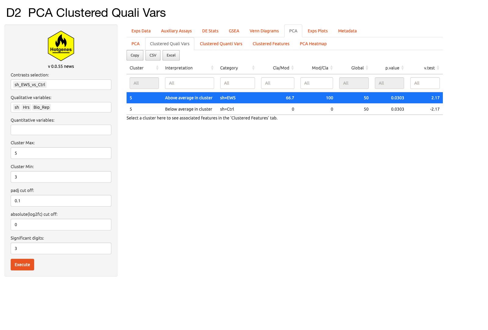
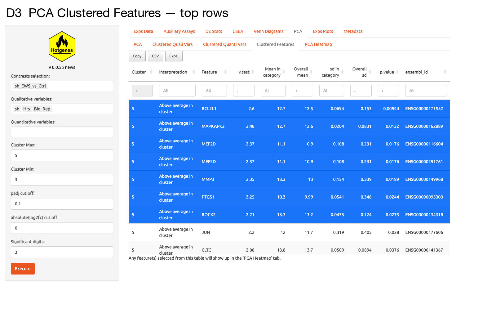
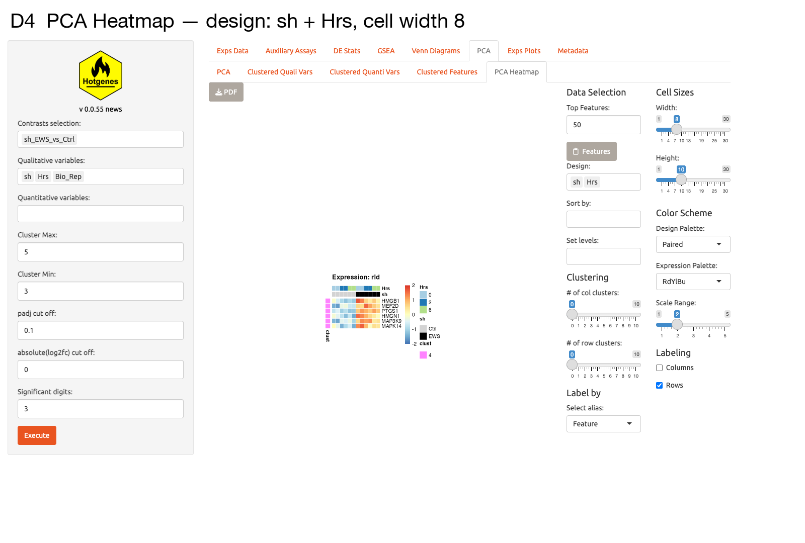

## Overview

`Shiny_Hotgenes()` can be used not only to explore results interactively,
but also to prioritize genes of interest from multiple complementary
perspectives. A typical workflow starts with differential expression
results, then refines candidates with multivariate structure from PCA,
overlap across contrasts from Venn diagrams, and pathway-level context
from the GSEA tab.

```{r set, eval=TRUE, include=FALSE}
knitr::opts_chunk$set(
  collapse  = TRUE,
  fig.path  = "04_Interactive_Exploration_Shiny_files/figure-",
  fig.height = 4, fig.width = 6
)
```

```{r load, message=FALSE}
library(Hotgenes)
```

## App Overview

The image below shows the full Shiny interface across the main tabs.


---

## 1. Launching the App with a Single Object

The simplest call passes one Hotgenes object:

```{r shiny_single, eval=FALSE}
# Load a pre-built example
fit_Hotgenes <- readRDS(
  system.file("extdata", "fit_Hotgenes.RDS",
              package = "Hotgenes",
              mustWork = TRUE)
)

Shiny_Hotgenes(fit_Hotgenes)
```

The app opens in your default browser (or the RStudio viewer pane).
Stop it by pressing **Escape** or closing the browser tab.

---

## 2. Start with DE Stats

The **DE Stats** tab is often the first step for identifying candidate
genes. Filters on adjusted p-value, fold change, and labels provide a
fast first-pass shortlist, and the heatmap subtab helps review global
expression patterns across samples. In strong contrasts, this step can
still produce long candidate lists.

<table>
<tr>
<td width="55%">

DE statistics and subtab views captured from the interactive app.

</td>
<td width="45%">


</td>
</tr>
</table>

---

## 3. Refine Candidates with PCA

The **PCA** tab helps refine candidate genes by revealing structure
linked to key biological conditions.

- **PCA** shows sample separation patterns.
- **Clustered Quali Vars** links metadata variables to dominant axes.
- **Clustered Features** highlights features driving those patterns
  (and can be shared to the GSEA tab).
- **PCA Heatmap** provides a compact annotated view of clustered features.

<table>
<tr>
<td width="55%">

The **PCA** tab provides sample-level principal component analysis.

</td>
<td width="45%">






</td>
</tr>
</table>

---

## 4. Compare Key Contrasts with Venn Diagram

The **Venn Diagram** tab helps narrow broad DE lists by identifying:

- genes shared across selected contrasts (with or without directionality),
- genes specific to one contrast,
- smaller intersection sets that are easier to prioritize.

After identifying shared or contrast-specific sets, review those
candidates in the **VennD Heatmap** subtab.

<table>
<tr>
<td width="55%">

Overlap analysis across selected contrasts.

</td>
<td width="45%">


</td>
</tr>
</table>

---

## 5. Link Genes to Biology with GSEA

The **GSEA** tab connects DE patterns to biological pathways. This step
helps move from statistically significant genes to biologically grounded
candidates by inspecting enriched pathways and leading-edge genes.
Genes prioritized from enriched pathways or leading-edge results can
then be reviewed in the **Heatmap** subtab (within **GSEA**) and the
**Expression Plots** tab.

<table>
<tr>
<td width="55%">

GSEA tab for pathway-level interpretation and leading-edge exploration.

</td>
<td width="45%">


</td>
</tr>
</table>

---

## 6. Visualize Selected Genes with Expression Plots

Once genes are prioritized, the **Expression Plots** tab is useful to
inspect expression trajectories for selected genes across samples and
conditions.

<table>
<tr>
<td width="55%">

Expression trajectory plots for selected genes and contrasts.

</td>
<td width="45%">


</td>
</tr>
</table>

---

## 7. Comparing Multiple Objects in the Same App

Pass a **named list** of Hotgenes objects to switch between experiments
in the app. The names become labels in the dataset selector.

```{r shiny_list, eval=FALSE}
# Load a second object (DESeq2-based example)
dds_Hotgenes <- readRDS(
  system.file("extdata", "dds_Hotgenes.RDS",
              package = "Hotgenes",
              mustWork = TRUE)
) |> update_object()

# Combine into a named list
Hotgenes_list <- list(
  limma_Ewing  = fit_Hotgenes,
  DESeq2_Ewing = dds_Hotgenes
)

Shiny_Hotgenes(Hotgenes_list)
```

---

## 8. Tips for Large Datasets

| Tip | Rationale |
|---|---|
| Store objects as `.RDS` files and load them with `readRDS()` | Avoids re-running expensive analyses every session |
| Use `update_object()` when loading saved objects | Ensures slot structure matches the current package version |
| Subset contrasts with `contrasts = c("A_vs_B")` | Reduces memory usage in app tables and plots |
| Set `padj_cut` and `.log2FoldChange` tightly | Speeds up Venn and heatmap calculations for large feature spaces |
| Pre-compute GSEA results before launching the app | Reduces waiting time during pathway exploration |

---

## Summary

```{r summary_table, echo=FALSE}
summary_tbl <- data.frame(
  Tab_or_Feature = c(
    "DE Stats",
    "PCA",
    "Venn Diagram",
    "GSEA",
    "Expression Plots",
    "Multi-object selector"
  ),
  Role_in_prioritization = c(
    "First-pass filtering by DE statistics and thresholds",
    "Refines candidates using multivariate sample/feature structure",
    "Finds shared vs contrast-specific candidates",
    "Links candidate genes to enriched biological pathways",
    "Validates expression behavior of selected genes",
    "Compares candidate behavior across Hotgenes objects"
  )
)
knitr::kable(summary_tbl)
```
