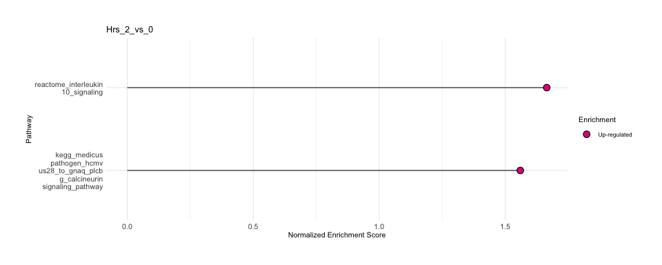
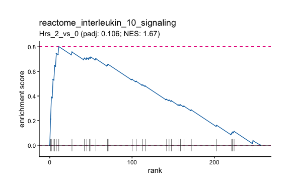

Interactive Exploration with Shiny
================

## Overview

`Shiny_Hotgenes()` launches an interactive web application that lets you
explore any Hotgenes object—or a named list of Hotgenes objects—without
writing additional code. The app bundles the most common analysis tasks
into point-and-click panels:

- **DE Summary** — filterable table of differential expression results
- **Volcano plots** — interactive volcano plots per contrast
- **Heatmaps** — top-hit heatmaps with flexible sample/gene selection
- **Expression plots** — per-gene trajectory plots
- **Venn diagrams** — overlap across contrasts
- **GSEA** — gene-set enrichment via `fgsea` with `msigdbr` or custom
  gene sets
- **GSVA** — sample-wise pathway activity scores via GSVA/ssGSEA

``` r
library(Hotgenes)
```

------------------------------------------------------------------------

## 1. Launching the App with a Single Object

The simplest call passes one Hotgenes object:

``` r
# Load a pre-built example
fit_Hotgenes <- readRDS(
  system.file("extdata", "fit_Hotgenes.RDS",
              package = "Hotgenes",
              mustWork = TRUE)
)

Shiny_Hotgenes(fit_Hotgenes)
```

The app opens in your default browser (or the RStudio viewer pane). Stop
it by pressing **Escape** or closing the browser tab.

------------------------------------------------------------------------

## 2. Comparing Multiple Objects Side-by-Side

Pass a **named list** of Hotgenes objects to switch between experiments
in the app. The names become the labels in the dataset selector:

``` r
# Load a second object (DESeq2-based example)
dds_Hotgenes <- readRDS(
  system.file("extdata", "dds_Hotgenes.RDS",
              package = "Hotgenes",
              mustWork = TRUE)
) |> update_object()

# Combine into a named list
Hotgenes_list <- list(
  limma_Ewing  = fit_Hotgenes,
  DESeq2_Ewing = dds_Hotgenes
)

Shiny_Hotgenes(Hotgenes_list)
```

------------------------------------------------------------------------

## 3. Gene-Set Enrichment Analysis (GSEA)

### Built-in msigdbr gene sets

`msigdbr_wrapper()` returns a named list of gene sets sourced from the
MSigDB via the `msigdbr` package. Any collection supported by `msigdbr`
can be used.

``` r
# Retrieve KEGG and Reactome pathways for human
H_paths <- msigdbr_wrapper(
  species  = "human",
  set      = c("CP:KEGG_MEDICUS", "CP:REACTOME"),
  gene_col = "gene_symbol"
)

length(H_paths)
## [1] 2445
H_paths |> names() |> head(5)
## [1] "kegg_medicus_env_factor_arsenic_to_electron_transfer_in_complex_iv"        
## [2] "kegg_medicus_env_factor_benzo_a_pyrenre_to_cyp_mediated_metabolism"        
## [3] "kegg_medicus_env_factor_dce_to_dna_adducts"                                
## [4] "kegg_medicus_env_factor_e2_to_nuclear_initiated_estrogen_signaling_pathway"
## [5] "kegg_medicus_env_factor_e2_to_ras_erk_signaling_pathway"
```

### Running GSEA with `fgsea_()`

`fgsea_()` is a wrapper around `fgsea::fgsea()` that accepts the ranked
vector returned by `DE(..., Report = "Ranks")`:

``` r
fit_Hotgenes <- readRDS(
  system.file("extdata", "fit_Hotgenes.RDS",
              package = "Hotgenes",
              mustWork = TRUE)
)

# Get ranked statistics for one contrast
InputRanks <- fit_Hotgenes |>
  DE(
    Report    = "Ranks",
    contrasts  = "Hrs_2_vs_0",
    Rank_name = "Feature",
    padj_cut  = 1
  )

head(InputRanks)
## $Hrs_2_vs_0
##          IL6        CXCL8      TNFAIP3        CXCL1         IL11        PTGS2        SMAD7         CCL2 
##  31.12496750  25.98004282  24.94190259  21.79835914  21.68592604  17.06293651  16.53569829  15.09389281 
##          JUN        CXCL3        CXCL2         RELB       TGFBR1         MAFF        CXCR4        MEF2A 
##  10.79581607   9.98782193   9.58885588   8.05432282   6.03321917   5.88144562   5.31761244   4.84732648 
##        MEF2D        NFKB1         MAFK         IRF1        CEBPB          MYC        RIPK2        BIRC2 
##   4.66315159   4.64960062   4.48330579   4.36800296   4.27929921   4.27606698   4.17890356   4.09494057 
##         MAFG       NFE2L2         CSF2        PDGFA        HDAC4     MAPKAPK2         FLT1        MEF2C 
##   3.82674300   3.44868294   3.28577631   3.16633965   3.06653719   2.62093557   2.59949823   2.57700686 
##       MAP3K9         DAXX         CCL7         CD40        TGFB2      CYSLTR1        RIPK1        CXCL6 
##   2.57592560   2.35944166   2.12431215   2.10168182   2.08248372   1.99075732   1.98105227   1.97979662 
##        NR3C1        IL1RN        MAPK8        ITGB2          TNF        TGFB3         ATF2         IL18 
##   1.86633763   1.75080224   1.68287265   1.62711874   1.56196039   1.55687452   1.55042432   1.53454768 
##       PTGER4         IL1B        TRAF2       MAP3K7         IRF5        CXCL5         BCL6         CSF3 
##   1.53086397   1.47488188   1.42852372   1.42600506   1.41808658   1.41371692   1.29608890   1.26819074 
##         RELA         IL13         TSLP        ROCK2        CCL11         AREG       CD40LG        HIF1A 
##   1.20207429   1.16175600   1.12117917   1.11632983   1.11359676   1.11086439   1.09751873   1.04609103 
##       PTGER1       BCL2L1          IL3         KNG1         C1QA         CCL5       CXCL10        FASLG 
##   1.02055444   1.00501404   0.98515137   0.97556954   0.92585162   0.89375856   0.88421812   0.87868647 
##           C9          IL5          C4A       TOLLIP        PTGIR        MASP2        LTB4R          LTB 
##   0.87023418   0.82511049   0.82109288   0.78525478   0.70358778   0.70316793   0.68159414   0.68083127 
##        CCL16        IL23R         PTK2       MAP2K4         TLR5         TLR9       IL1RAP           C7 
##   0.65466413   0.63867324   0.63012487   0.61883216   0.57534014   0.56226334   0.55233024   0.53236635 
##        TREM2        C3AR1        CXCR1         GNAQ         MMP9        HSPB1        CCL21         IL15 
##   0.52071474   0.50014818   0.48109112   0.45347915   0.44974208   0.44366304   0.43900239   0.41940831 
##         IRF3         RAF1          IL7        IL12B           C3     MAPKAPK5      IL22RA2       LTB4R2 
##   0.40929786   0.39512511   0.38803903   0.36208872   0.35733936   0.33255213   0.32966420   0.29329595 
##         CCR2         CFL1        CCL13         HRAS        PLCB1        DEFA1         CCR3        NLRP3 
##   0.29026796   0.28392971   0.24997558   0.23750510   0.23233514   0.22152530   0.19425589   0.17691775 
##        IL12A       ALOX12       MAP3K5         IL10         CD55     PPP1R12B       TYROBP         IL21 
##   0.17192731   0.11803544   0.11257715   0.07049029   0.04164493   0.03273288   0.01908684  -0.02715473 
##      RAPGEF2       PTGER2          MX1     HLA-DRB1          MAX        TGFB1        CDC42         CCR4 
##  -0.03573188  -0.07132734  -0.10711170  -0.11494404  -0.12702207  -0.13446055  -0.13944059  -0.16273839 
##       TBXA2R          IL9        PRKCB         MBL2         OAS2       NFATC3        HSH2D       MAP2K6 
##  -0.16578701  -0.17175030  -0.18321154  -0.18909605  -0.19586590  -0.22109960  -0.22322920  -0.24672365 
##        CCL17         GNB1        CCL23           C2      CYSLTR2         CD86         GUSB         CCR7 
##  -0.27558901  -0.27905203  -0.30109387  -0.31284412  -0.31859902  -0.32658781  -0.36504898  -0.39340560 
##         CCL3         CLTC         ELK1         CCL4          C8A           C6         MRC1         IL6R 
##  -0.40932555  -0.41360125  -0.43477737  -0.43495584  -0.43542633  -0.45037882  -0.46454007  -0.48483912 
##          CRP        MAPK3        TRADD          CD4        STAT3          MX2       IL10RB         IFNG 
##  -0.49506116  -0.49670809  -0.49724695  -0.50015465  -0.51248203  -0.51665070  -0.52107615  -0.52166257 
##         TLR3        IFNB1         CCR1        LIMK1         C1QB         MMP3       MAP2K1        IFNA1 
##  -0.52490834  -0.52527964  -0.52705610  -0.55040763  -0.55464127  -0.55534166  -0.56742483  -0.58595021 
##         NOX1      PLA2G4A        IFI44         CSF1       PTGDR2          C8B      RPS6KA5         TCF4 
##  -0.60318503  -0.60425065  -0.62374840  -0.63139792  -0.67323500  -0.67599752  -0.69570555  -0.71761744 
##        MAPK1        CCL24        CREB1         MYL2        HPRT1        ALOX5         IL22          CFD 
##  -0.72154128  -0.77324856  -0.77854898  -0.78028772  -0.79434697  -0.81096726  -0.81179754  -0.83837087 
##      TNFSF14        IL17A        IL23A         NOD2         NOS2         RAC1         CCL8           C5 
##  -0.84693770  -0.85326865  -0.89927905  -0.92879070  -0.94735857  -0.95538776  -0.96622714  -0.96804286 
##         TLR2        CD163        MASP1         AGER      IL18RAP       MAPK14        PRKCA         TLR6 
##  -0.97592725  -0.99995455  -1.02607220  -1.02921647  -1.03206040  -1.03729998  -1.04227818  -1.07145456 
##         TUBB         GRB2        CCL22          LTA         LY96       ALOX15        PTGS1         TLR4 
##  -1.08436819  -1.12146944  -1.13229480  -1.13355234  -1.22559844  -1.22726457  -1.26261845  -1.29013001 
##         PGK1         IRF7      PIK3C2G         SHC1         GNAS         OASL         TLR1         TLR8 
##  -1.29127909  -1.30993072  -1.32230865  -1.33245671  -1.34368612  -1.34534883  -1.35958553  -1.36288599 
##        STAT1        HMGN1      HLA-DRA          IL4        CCL20         IL1A        GNGT1        CCL19 
##  -1.39027600  -1.40517148  -1.43907514  -1.45850756  -1.50499836  -1.51250737  -1.51984271  -1.52691540 
##          CFB         ARG1         NOD1         RHOA          C1S        HSPB2 BORCS8-MEF2B       PTGER3 
##  -1.55175627  -1.56398496  -1.67734955  -1.70876245  -1.71233411  -1.73419783  -1.78969599  -1.81009125 
##        CXCR2        IFIT3        MYD88          C1R        HMGB1        MKNK1        CXCL9         TLR7 
##  -1.81332048  -1.95111436  -2.00239473  -2.00785510  -2.01203200  -2.08879664  -2.15427180  -2.17742739 
##        FXYD2        STAT2       MAP3K1        GAPDH        IFIT1        OXER1        IL1R1       TWIST2 
##  -2.17969776  -2.29396992  -2.47976806  -2.79400322  -2.90411648  -2.92293349  -3.11975099  -3.26092491 
##        KEAP1          IL2          FOS        PTGFR        HMGB2        IFIT2        DDIT3 
##  -3.41035505  -3.81521305  -4.38854261  -4.45107850  -5.18000992  -6.77641373  -6.77716432
```

``` r
# Run GSEA
Out_GSEA <- fgsea_(
  Ranks    = InputRanks,
  pathways = H_paths,
  nproc    = 1,
  minSize  = 5,
  maxSize  = Inf
)
##   |                                                                                                       |                                                                                               |   0%  |                                                                                                       |=======                                                                                        |   7%  |                                                                                                       |==============                                                                                 |  14%  |                                                                                                       |====================                                                                           |  21%  |                                                                                                       |===========================                                                                    |  29%  |                                                                                                       |==================================                                                             |  36%  |                                                                                                       |=========================================                                                      |  43%  |                                                                                                       |================================================                                               |  50%  |                                                                                                       |======================================================                                         |  57%  |                                                                                                       |=============================================================                                  |  64%  |                                                                                                       |====================================================================                           |  71%  |                                                                                                       |===========================================================================                    |  79%  |                                                                                                       |=================================================================================              |  86%  |                                                                                                       |========================================================================================       |  93%  |                                                                                                       |===============================================================================================| 100%
```

### Inspecting GSEA results

``` r
# Tabular summary of significant pathways
Out_GSEA |>
  fgsea_Results(
    contrasts = "Hrs_2_vs_0",
    padj_cut  = 0.2,
    mode      = "D"
  ) |> head()
## $Hrs_2_vs_0
## # A tibble: 2 × 9
##   pathway                                       pval  padj log2err    ES   NES  size leadingEdge sign_NES
##   <chr>                                        <dbl> <dbl>   <dbl> <dbl> <dbl> <int> <list>         <dbl>
## 1 reactome_interleukin_10_signaling          4.34e-4 0.106   0.498 0.802  1.67    30 <chr [6]>          1
## 2 kegg_medicus_pathogen_hcmv_us28_to_gnaq_p… 6.38e-4 0.106   0.477 0.963  1.56     5 <chr [2]>          1
```

``` r
# Leading-edge genes for one pathway
Out_GSEA |>
  fgsea_Results(
    contrasts = "Hrs_2_vs_0",
    padj_cut  = 0.2,
    mode      = "leadingEdge"
  ) |> head()
## $Hrs_2_vs_0
## $Hrs_2_vs_0$reactome_interleukin_10_signaling
## [1] "IL6"   "CXCL8" "CXCL1" "PTGS2" "CCL2"  "CXCL2"
## 
## $Hrs_2_vs_0$kegg_medicus_pathogen_hcmv_us28_to_gnaq_plcb_g_calcineurin_signaling_pathway
## [1] "CXCL8" "PTGS2"
```

### Visualizing GSEA results

``` r
Out_GSEA |>
  GSEA_Plots(
    contrasts = "Hrs_2_vs_0",
    padj_cut  = 0.2,
    Topn      = 3,
    width     = 20
  )
## $Hrs_2_vs_0
```

<!-- -->

``` r
# Enrichment plot for a single pathway
# (replace with a pathway name present in your results)
sig_paths <- Out_GSEA |>
  fgsea_Results(contrasts = "Hrs_2_vs_0",
                padj_cut  = 0.2,
                mode      = "D")

if (nrow(sig_paths$Hrs_2_vs_0) > 0) {
  first_geneset_name <- sig_paths$Hrs_2_vs_0$pathway[1]
  
  plotEnrichment_(fgseaRes = Out_GSEA, contrast = "Hrs_2_vs_0", 
                genesetName = first_geneset_name)

}
## Leading edge genes for reactome_interleukin_10_signaling:
## ℹ IL6, CXCL8, CXCL1, PTGS2, CCL2, CXCL2
```

<!-- -->

``` r
# Retrieve the leading-edge gene list for one pathway
if (nrow(sig_paths$Hrs_2_vs_0) > 0) {
    first_geneset_name <- sig_paths$Hrs_2_vs_0$pathway[1]

  leadingGenes(fgseaRes = Out_GSEA, contrast = "Hrs_2_vs_0", 
                genesetName = first_geneset_name)
}
## [1] "IL6"   "CXCL8" "CXCL1" "PTGS2" "CCL2"  "CXCL2"
```

------------------------------------------------------------------------

## 4. Sample-wise Pathway Activity with `HotgeneSets()`

`HotgeneSets()` runs GSVA (or ssGSEA, PLAGE, etc.) on the expression
data to produce per-sample pathway activity scores, then returns a new
Hotgenes object with the pathway scores as the expression matrix.

``` r
# Use the same gene sets as above
HotgeneSets_out <- HotgeneSets(
  Hotgenes = fit_Hotgenes,
  geneSets = H_paths,
  kcdf     = "Gaussian",
  method   = "ssgsea",
  minSize  = 2,
  maxSize  = Inf
)

HotgeneSets_out
## class: Hotgenes 
## Original class/package:  EList/limma
## 
## Differential expression (default thresholds): 
## |contrast       | total|
## |:--------------|-----:|
## |Hrs_2_vs_0     |   496|
## |Hrs_6_vs_0     |   548|
## |sh_EWS_vs_Ctrl |   147|
## |shEWS.Hrs2     |     5|
## |shEWS.Hrs6     |    87|
## 
## Available feature mapping:  Feature, original_features, size 
## ExpressionSlots:  ssgsea 
## Total auxiliary assays:  0 
## Total samples:  12
```

The result is a Hotgenes object whose expression matrix rows are pathway
names and whose DE slot contains pathway-level differential activity
results. You can pass it directly to `Shiny_Hotgenes()`.

------------------------------------------------------------------------

## 5. Custom Gene Sets in the Shiny App

You can configure the Shiny app to use your own gene-set retrieval
function (or expose multiple databases) via `OntologyMethods()` and
`OntologyFunctions()`:

``` r
# Define custom database functions
Custom_db <- OntologyMethods(
  Ontology_Function  = list("msigdbr" = msigdbr_wrapper),
  InputChoices       = list("msigdbr" = c("CP:REACTOME", "CP:KEGG", "H")),
  gene_col_choices   = list("msigdbr" = c("gene_symbol",
                                           "entrez_gene",
                                           "ensembl_gene")),
  species_choices    = list("msigdbr" = c("human", "mouse", "rat")),
  versions           = list("msigdbr" = packageVersion("msigdbr"))
)

# Pass to Shiny app
Shiny_Hotgenes(fit_Hotgenes, OntologyDB = Custom_db)
```

To supply pre-computed gene sets (bypassing in-app database queries):

``` r
# Use the pathways list returned by msigdbr_wrapper()
Shiny_Hotgenes(fit_Hotgenes, gene_sets = H_paths)
```

------------------------------------------------------------------------

## 6. Tips for Large Datasets

| Tip | Rationale |
|----|----|
| Store objects as `.RDS` files and load them with `readRDS()` | Avoids re-running expensive analyses every session |
| Use `update_object()` when loading saved objects | Ensures slot structure matches the current package version |
| Subset contrasts with `contrasts = c("A_vs_B")` | Reduces memory usage in `DE()` and plot functions |
| Set `padj_cut` and `.log2FoldChange` tightly | Speeds up Venn diagrams and heatmaps for large gene lists |
| Prefer `method = "ssgsea"` over `"gsva"` for sparse data | ssGSEA is more robust when many zeros are present |
| Pre-compute GSEA results and pass `Out_GSEA` to the app | Avoids waiting for `fgsea_` inside the app for large pathway databases |

------------------------------------------------------------------------

## Summary

| Function           | Purpose                                           |
|:-------------------|:--------------------------------------------------|
| Shiny_Hotgenes()   | Launch the interactive Shiny app                  |
| msigdbr_wrapper()  | Retrieve MSigDB gene sets via msigdbr             |
| fgsea\_()          | Run fgsea gene-set enrichment                     |
| fgsea_Results()    | Extract GSEA results table                        |
| GSEA_Plots()       | Bar plot of top enriched pathways                 |
| plotEnrichment\_() | Enrichment curve for one pathway                  |
| leadingGenes()     | Leading-edge genes for one pathway                |
| HotgeneSets()      | Compute GSVA/ssGSEA pathway activity              |
| OntologyMethods()  | Define custom gene-set database methods for Shiny |
