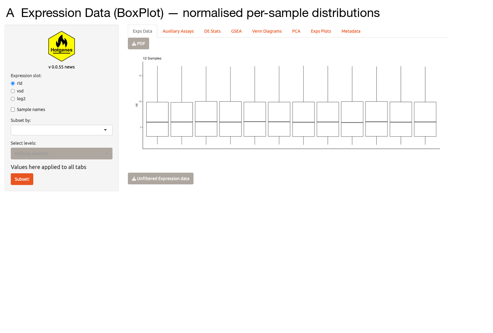
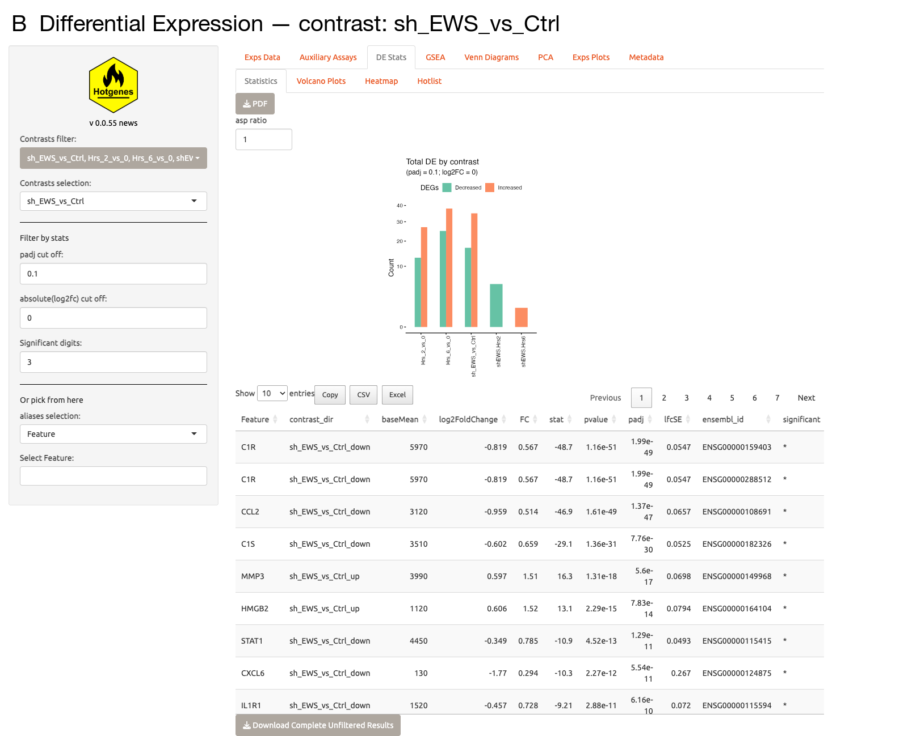
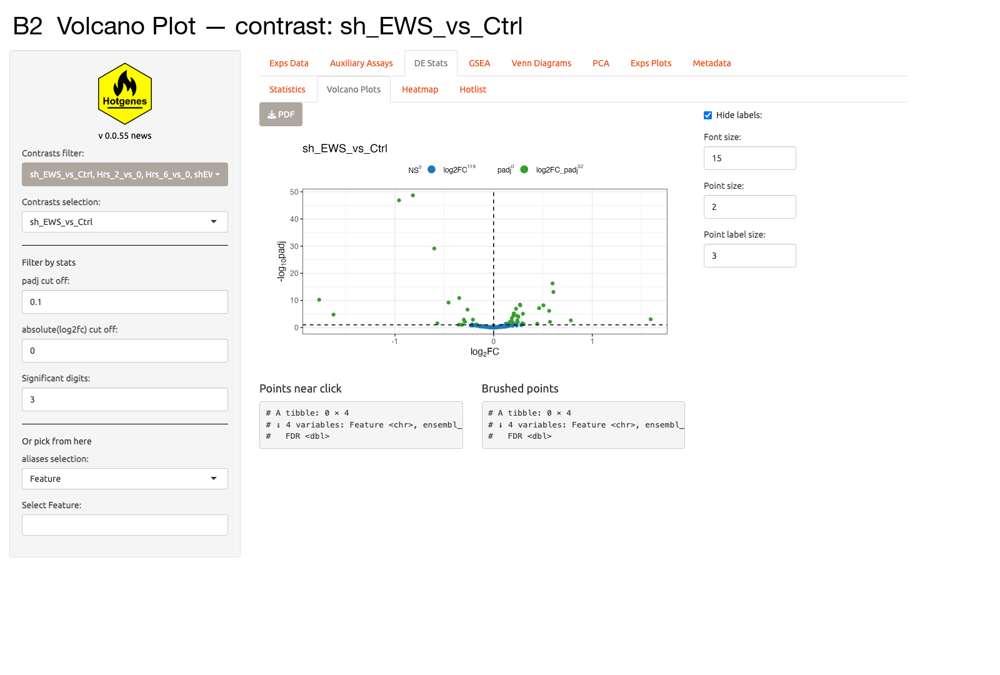
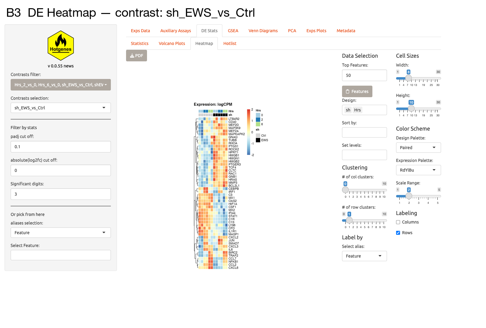
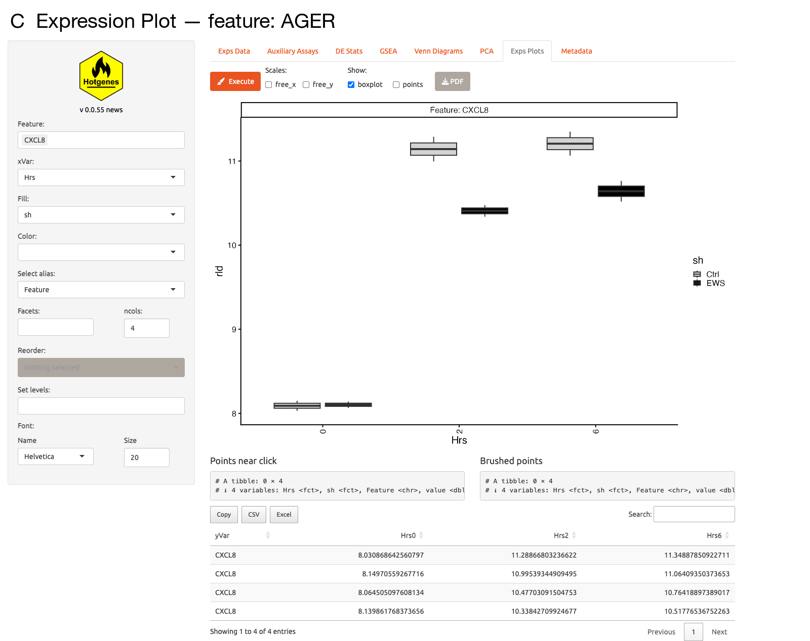
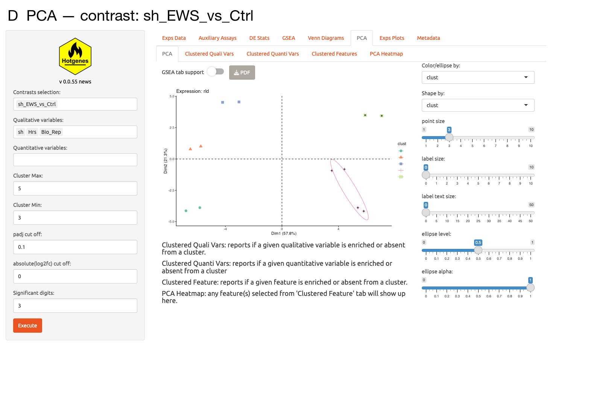
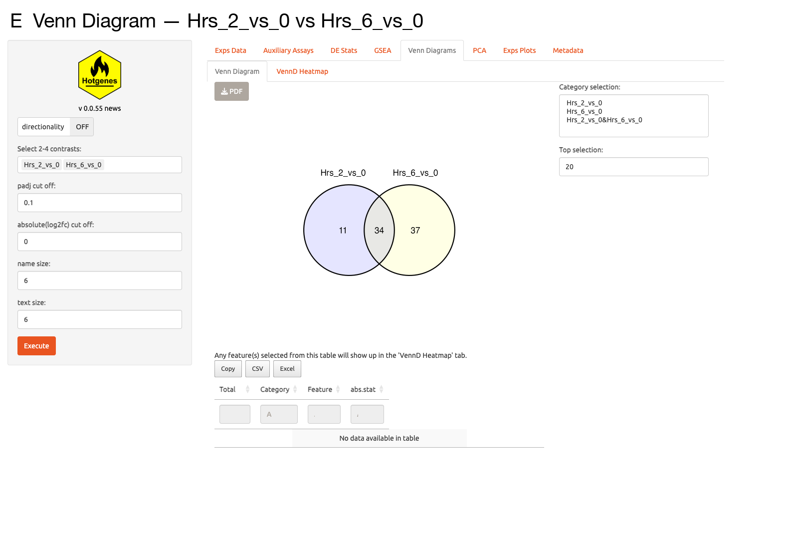
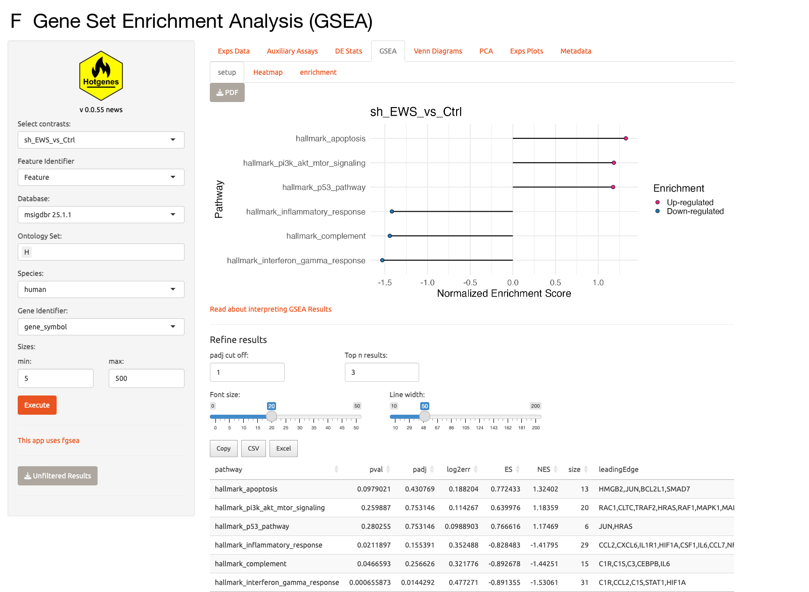
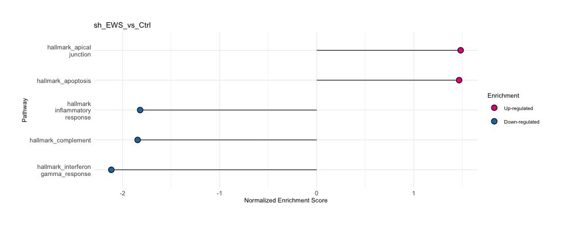
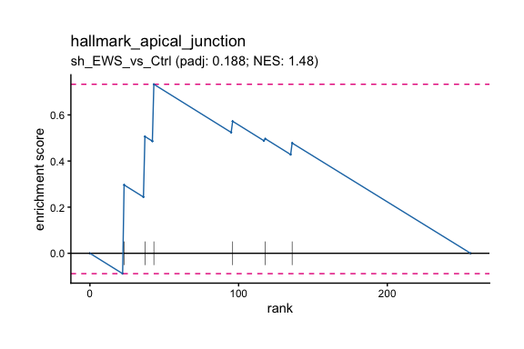

Interactive Exploration with Shiny
================

## Overview

`Shiny_Hotgenes()` launches an interactive web application that lets you
explore any Hotgenes object—or a named list of Hotgenes objects—without
writing additional code. The app bundles the most common analysis tasks
into point-and-click panels:

- **DE Summary** — filterable table of differential expression results
- **Volcano plots** — interactive volcano plots per contrast
- **Heatmaps** — top-hit heatmaps with flexible sample/gene selection
- **Expression plots** — per-gene trajectory plots
- **Venn diagrams** — overlap across contrasts
- **GSEA** — gene-set enrichment via `fgsea` with `msigdbr` or custom
  gene sets
- **GSVA** — sample-wise pathway activity scores via GSVA/ssGSEA

``` r
library(Hotgenes)
```

## App Overview

The image below shows the full Shiny interface across the main tabs.

<figure>

<figcaption aria-hidden="true">Hotgenes Shiny app overview</figcaption>
</figure>

> **Regenerating screenshots**
>
> Screenshots were generated with
> `data-raw/shiny_ui/shiny_shots_optimized.R`. Run that script, then
> copy the PNGs from `tempdir()` into `vignettes/figures/`.

------------------------------------------------------------------------

## 1. Launching the App with a Single Object

The simplest call passes one Hotgenes object:

``` r
# Load a pre-built example
fit_Hotgenes <- readRDS(
  system.file("extdata", "fit_Hotgenes.RDS",
              package = "Hotgenes",
              mustWork = TRUE)
)

Shiny_Hotgenes(fit_Hotgenes)
```

The app opens in your default browser (or the RStudio viewer pane). Stop
it by pressing **Escape** or closing the browser tab.

------------------------------------------------------------------------

<table>

<tr>

<td width="55%">

After launching `Shiny_Hotgenes(fit_Hotgenes)`, the app opens to the
default expression/boxplot view.

</td>

<td width="45%">

<figure>

<figcaption aria-hidden="true">BoxPlot / Expression Data
tab</figcaption>
</figure>

</td>

</tr>

</table>

------------------------------------------------------------------------

## 2. DE Stats

Use the app launched above and navigate to **DE Stats** to inspect
statistics, volcano, and heatmap subtabs.

<table>

<tr>

<td width="55%">

DE statistics and subtab views captured from the interactive app.

</td>

<td width="45%">

<figure>

<figcaption aria-hidden="true">DE Stats / Statistics subtab</figcaption>
</figure>

<figure>

<figcaption aria-hidden="true">DE Stats / Volcano Plots
subtab</figcaption>
</figure>

<figure>

<figcaption aria-hidden="true">DE Stats / Heatmap subtab</figcaption>
</figure>

</td>

</tr>

</table>

------------------------------------------------------------------------

## 3. Comparing Multiple Objects In The Same App

Pass a **named list** of Hotgenes objects to switch between experiments
in the app. The names become the labels in the dataset selector:

``` r
# Load a second object (DESeq2-based example)
dds_Hotgenes <- readRDS(
  system.file("extdata", "dds_Hotgenes.RDS",
              package = "Hotgenes",
              mustWork = TRUE)
) |> update_object()

# Combine into a named list
Hotgenes_list <- list(
  limma_Ewing  = fit_Hotgenes,
  DESeq2_Ewing = dds_Hotgenes
)

Shiny_Hotgenes(Hotgenes_list)
```

------------------------------------------------------------------------

## 4. Expression Plots

In the same app session, open the **Expression Plots** tab.

<table>

<tr>

<td width="55%">

Expression trajectory plots for selected genes and contrasts.

</td>

<td width="45%">

<figure>

<figcaption aria-hidden="true">Expression Plots tab</figcaption>
</figure>

</td>

</tr>

</table>

------------------------------------------------------------------------

## 5. PCA

In the same app session, open the **PCA** tab.

<table>

<tr>

<td width="55%">

Principal component analysis view for sample-level exploration.

</td>

<td width="45%">

<figure>

<figcaption aria-hidden="true">PCA tab</figcaption>
</figure>

</td>

</tr>

</table>

------------------------------------------------------------------------

## 6. Venn Diagram

In the same app session, open the **Venn Diagram** tab.

<table>

<tr>

<td width="55%">

Overlap analysis across selected contrasts.

</td>

<td width="45%">

<figure>

<figcaption aria-hidden="true">Venn Diagram tab</figcaption>
</figure>

</td>

</tr>

</table>

------------------------------------------------------------------------

## 7. Gene-Set Enrichment Analysis (GSEA)

<table>

<tr>

<td width="55%">

The GSEA tab in `Shiny_Hotgenes()` complements the command-line workflow
below.

</td>

<td width="45%">

<figure>

<figcaption aria-hidden="true">GSEA tab</figcaption>
</figure>

</td>

</tr>

</table>

### Built-in msigdbr gene sets

`msigdbr_wrapper()` returns a named list of gene sets sourced from the
MSigDB via the `msigdbr` package. Any collection supported by `msigdbr`
can be used.

``` r
# Retrieve KEGG and Reactome pathways for human
H_paths <- msigdbr_wrapper(
  species  = "human",
  set      = c("H"),
  gene_col = "gene_symbol"
)

length(H_paths)
## [1] 50
H_paths |> names() |> head(5)
## [1] "hallmark_adipogenesis"        "hallmark_allograft_rejection" "hallmark_androgen_response"  
## [4] "hallmark_angiogenesis"        "hallmark_apical_junction"
```

### Running GSEA with `fgsea_()`

`fgsea_()` is a wrapper around `fgsea::fgsea()` that accepts the ranked
vector returned by `DE(..., Report = "Ranks")`:

``` r
fit_Hotgenes <- readRDS(
  system.file("extdata", "fit_Hotgenes.RDS",
              package = "Hotgenes",
              mustWork = TRUE)
)

# Get ranked statistics for one contrast
InputRanks <- fit_Hotgenes |>
  DE(
    Report    = "Ranks",
    contrasts  = "sh_EWS_vs_Ctrl",
    Rank_name = "Feature",
    padj_cut  = 1
  )

head(InputRanks)
## $sh_EWS_vs_Ctrl
##         MMP3        HMGB2        MEF2D        PTGS1          JUN        HMGB1         RAC1       MAP3K9 
##   9.23196931   8.63826832   6.91859713   6.55635291   6.05519763   5.63392842   5.34665347   5.22983101 
##         GNB1         TUBB       BCL2L1       PTGER3        BIRC2        ROCK2        CXCL3        HMGN1 
##   4.93340815   4.75746470   4.69675031   4.44199537   4.05478250   4.03982126   3.99791138   3.81714901 
##        MEF2A         CLTC         GNAQ        TRAF2         CD40        CXCL2         HRAS        HPRT1 
##   3.53935236   3.28231690   3.25811676   3.22697764   3.15857799   2.99626024   2.92880736   2.88052300 
##        SMAD7         RHOA         TCF4     MAPKAPK2       LTB4R2         IL18        RIPK2        PLCB1 
##   2.84888019   2.84571370   2.73163608   2.72155543   2.54990152   2.43811463   2.34153355   2.29249232 
##         RAF1       MAP3K5        HSPB2        C3AR1         SHC1         FLT1        MAPK1        PRKCA 
##   2.21308496   2.10088683   2.06498990   2.04691182   1.99753727   1.99178517   1.97835698   1.97268600 
##         AGER         BCL6       MAPK14        NR3C1       ALOX12         CCR3       MAP2K1         RELA 
##   1.91980175   1.88135779   1.87734699   1.87308583   1.81846355   1.76542547   1.75116207   1.74003567 
##        MAPK8         CSF2        MEF2C        PTGS2      RPS6KA5         NOD1        CCL16      TNFAIP3 
##   1.70248065   1.69619991   1.66302886   1.65918469   1.57702114   1.57475870   1.52998464   1.52016828 
##         KNG1          IL7        HDAC4         CFL1        IL1RN         GNAS       MAP2K6           C9 
##   1.45713906   1.37151983   1.36197518   1.35910547   1.28807643   1.13923758   1.13682039   1.11379029 
##        TGFB1        CXCR4         TLR9       NFATC3       PTGER4        CREB1        PRKCB        PDGFA 
##   1.10907917   1.08688136   1.04211822   0.99403714   0.96579934   0.92827009   0.90364739   0.88111963 
##          IL5        CCL11         IL13        CCL23       TBXA2R        CXCR1          IL9          MYC 
##   0.85638689   0.83872011   0.83608986   0.78379499   0.78371335   0.73907642   0.68440559   0.68283007 
##        CDC42          CD4        IFNA1         MAFF         CSF3           C5       MAP3K7         C1QA 
##   0.64149979   0.63458716   0.63349190   0.63345455   0.61981183   0.58409989   0.57212744   0.57136316 
##         IL21          TNF        IFNB1       TOLLIP         IL10         IRF5         CCR4         CD86 
##   0.56323090   0.56185131   0.55960333   0.53718110   0.52533802   0.50062435   0.39346853   0.36857620 
##         PGK1        ITGB2       PTGER2      CYSLTR1       PTGER1         TSLP         CCR2        FXYD2 
##   0.35051302   0.34742610   0.32246173   0.29637546   0.27127102   0.26369319   0.25680206   0.24915511 
##        LIMK1         IL1B        GAPDH         TLR5          IL3           C7         GUSB        KEAP1 
##   0.22882858   0.21907742   0.20411311   0.18423028   0.17969763   0.14711371   0.14167607   0.12396588 
##         MAFG        LTB4R         AREG        GNGT1          C8A         PTK2        IL12A         OASL 
##   0.11430101   0.10602917   0.08918235   0.07272003   0.06829105   0.06355101   0.03876954   0.03663648 
##        OXER1         CCR7       CXCL10         MRC1         ATF2        TREM2        TGFB3        CXCR2 
##   0.01481433  -0.04508789  -0.05451975  -0.08015497  -0.09419450  -0.11124414  -0.11444802  -0.17076714 
##        CXCL8         NOS2      IL22RA2         ELK1        HSPB1        TGFB2          C4A         MMP9 
##  -0.18936019  -0.20298377  -0.21307741  -0.22752012  -0.24608467  -0.25794332  -0.31284137  -0.37912828 
##       MAP2K4           C2         IRF3          CRP       TYROBP        ALOX5     PPP1R12B      CYSLTR2 
##  -0.46437909  -0.48184256  -0.48844459  -0.49206283  -0.52135089  -0.56020537  -0.57878816  -0.63191174 
##         CCL8        IL12B        MYD88         MYL2        FASLG        CXCL5       ALOX15        CCL20 
##  -0.63357891  -0.64198240  -0.65038405  -0.66616429  -0.66761332  -0.66884649  -0.67378904  -0.70258198 
##        NLRP3         IL15         DAXX         IL22         MAFK        IL23R         GRB2          FOS 
##  -0.70696634  -0.71178944  -0.71290303  -0.73049341  -0.73646359  -0.73752846  -0.73811230  -0.74235993 
##       IL1RAP         CCL4         C1QB         ARG1        IFIT3       TWIST2       TGFBR1      HLA-DRA 
##  -0.80163491  -0.80245589  -0.80999697  -0.84137555  -0.84535559  -0.84602905  -0.85655367  -0.85924057 
##         CCL3          C8B        IL23A         NOX1         MBL2        RIPK1         IL11        CCL21 
##  -0.87792208  -0.90576344  -0.90860054  -0.91454048  -0.91689183  -0.94899158  -0.95395457  -0.98968590 
##       PTGDR2      PIK3C2G           C6        CCL24       CD40LG        CD163        CCL17        PTGFR 
##  -0.99050188  -1.00519745  -1.01649649  -1.03806427  -1.07576140  -1.08307756  -1.08502447  -1.09841469 
##        DDIT3     MAPKAPK5      PLA2G4A          LTB        MASP2        CCL13         TLR3        IFIT1 
##  -1.10025860  -1.10643401  -1.10773788  -1.11457576  -1.12837981  -1.12849322  -1.16468731  -1.17471821 
##       NFE2L2        CCL22     HLA-DRB1       MAP3K1        IL17A        TRADD          LTA      IL18RAP 
##  -1.18422620  -1.19042278  -1.19395048  -1.23714807  -1.29525695  -1.34336734  -1.36731548  -1.46906485 
##      RAPGEF2        STAT3        DEFA1        CXCL9         TLR4 BORCS8-MEF2B      TNFSF14         NOD2 
##  -1.49059634  -1.56494743  -1.61268606  -1.61341813  -1.69536667  -1.69979746  -1.76729005  -1.84041264 
##         CCL5         TLR2         IL6R          IL2         TLR1         IL1A         CD55          MAX 
##  -1.86370115  -1.86684727  -1.89635505  -1.90345655  -1.90718059  -1.94654165  -1.96167937  -1.99302345 
##          IL4         CCR1        IFIT2         IFNG        MAPK3       IL10RB        CCL19        STAT2 
##  -1.99733859  -2.02165377  -2.02397947  -2.03671124  -2.07009927  -2.08532800  -2.08885030  -2.12890080 
##        PTGIR          CFB         IRF7         TLR8         TLR7         TLR6        HSH2D        CXCL1 
##  -2.13014814  -2.13209391  -2.15587530  -2.17897238  -2.21150790  -2.25866406  -2.28351885  -2.34192970 
##        MKNK1         RELB         OAS2          MX1        NFKB1         IRF1          IL6         CCL7 
##  -2.43354751  -2.51879480  -2.62802391  -2.68294859  -2.84916512  -2.84978596  -2.92081969  -2.94422937 
##        IFI44          CFD         LY96          MX2        CEBPB        MASP1         CSF1           C3 
##  -3.06755028  -3.13692189  -3.22665502  -3.93543312  -4.55119889  -4.56206849  -4.66393919  -6.29401804 
##        HIF1A        STAT1        IL1R1        CXCL6          C1S         CCL2          C1R 
##  -7.17057201  -7.55684379  -7.99412875  -8.77610451 -12.28407654 -15.82342065 -16.73515625
```

``` r
# Run GSEA
Out_GSEA <- fgsea_(
  Ranks    = InputRanks,
  pathways = H_paths,
  nproc    = 1,
  minSize  = 5,
  maxSize  = Inf
)
##   |                                                                                                           |                                                                                                   |   0%  |                                                                                                           |====================                                                                               |  20%  |                                                                                                           |========================================                                                           |  40%  |                                                                                                           |===========================================================                                        |  60%  |                                                                                                           |===============================================================================                    |  80%  |                                                                                                           |===================================================================================================| 100%
```

### Inspecting GSEA results

``` r
# Tabular summary of significant pathways
Out_GSEA |>
  fgsea_Results(
    contrasts = "sh_EWS_vs_Ctrl",
    padj_cut  = 0.2,
    mode      = "D"
  ) |> head()
## $sh_EWS_vs_Ctrl
## # A tibble: 9 × 9
##   pathway                                 pval     padj log2err     ES   NES  size leadingEdge sign_NES
##   <chr>                                  <dbl>    <dbl>   <dbl>  <dbl> <dbl> <int> <list>         <dbl>
## 1 hallmark_apical_junction           0.0671    0.191      0.249  0.733  1.49     6 <chr [3]>          1
## 2 hallmark_apoptosis                 0.0749    0.191      0.234  0.548  1.46    17 <chr [5]>          1
## 3 hallmark_coagulation               0.0650    0.191      0.249 -0.585 -1.44    16 <chr [4]>         -1
## 4 hallmark_il6_jak_stat3_signaling   0.0606    0.191      0.253 -0.530 -1.45    24 <chr [13]>        -1
## 5 hallmark_allograft_rejection       0.0158    0.0727     0.352 -0.474 -1.52    54 <chr [22]>        -1
## 6 hallmark_interferon_alpha_response 0.00643   0.0370     0.407 -0.736 -1.78    14 <chr [8]>         -1
## 7 hallmark_inflammatory_response     0.00192   0.0147     0.455 -0.580 -1.80    43 <chr [20]>        -1
## 8 hallmark_complement                0.00125   0.0144     0.455 -0.708 -1.85    20 <chr [9]>         -1
## 9 hallmark_interferon_gamma_response 0.0000120 0.000276   0.593 -0.700 -2.11    37 <chr [16]>        -1
```

``` r
# Leading-edge genes for one pathway
Out_GSEA |>
  fgsea_Results(
    contrasts = "sh_EWS_vs_Ctrl",
    padj_cut  = 0.2,
    mode      = "leadingEdge"
  ) |> head()
## $sh_EWS_vs_Ctrl
## $sh_EWS_vs_Ctrl$hallmark_apical_junction
## [1] "HRAS"   "SHC1"   "MAPK14"
## 
## $sh_EWS_vs_Ctrl$hallmark_apoptosis
## [1] "HMGB2"  "JUN"    "BCL2L1" "SMAD7"  "IL18"  
## 
## $sh_EWS_vs_Ctrl$hallmark_coagulation
## [1] "C1R" "C1S" "C3"  "CFD"
## 
## $sh_EWS_vs_Ctrl$hallmark_il6_jak_stat3_signaling
##  [1] "IL1R1"  "STAT1"  "CSF1"   "CCL7"   "IL6"    "IRF1"   "CXCL1"  "STAT2"  "IL10RB" "CCR1"   "TLR2"  
## [12] "CXCL9"  "STAT3" 
## 
## $sh_EWS_vs_Ctrl$hallmark_allograft_rejection
##  [1] "CCL2"    "STAT1"   "HIF1A"   "CSF1"    "CCL7"    "IL6"     "TLR6"    "IRF7"    "CCL19"   "IFNG"   
## [11] "CCR1"    "IL4"     "TLR1"    "IL2"     "TLR2"    "CCL5"    "CXCL9"   "IL18RAP" "CCL22"   "TLR3"   
## [21] "CCL13"   "LTB"    
## 
## $sh_EWS_vs_Ctrl$hallmark_interferon_alpha_response
## [1] "C1S"   "CSF1"  "IFI44" "IRF1"  "MX1"   "IRF7"  "STAT2" "IFIT2"
## 
## $sh_EWS_vs_Ctrl$hallmark_inflammatory_response
##  [1] "CCL2"    "CXCL6"   "IL1R1"   "HIF1A"   "CSF1"    "CCL7"    "IL6"     "IRF1"    "NFKB1"   "IRF7"   
## [11] "PTGIR"   "CD55"    "IL1A"    "TLR1"    "TLR2"    "CCL5"    "NOD2"    "CXCL9"   "IL18RAP" "LTA"    
## 
## $sh_EWS_vs_Ctrl$hallmark_complement
## [1] "C1R"   "C1S"   "C3"    "CEBPB" "IL6"   "IRF1"  "CXCL1" "IRF7"  "CFB"  
## 
## $sh_EWS_vs_Ctrl$hallmark_interferon_gamma_response
##  [1] "C1R"   "CCL2"  "C1S"   "STAT1" "HIF1A" "MX2"   "IFI44" "CCL7"  "IL6"   "IRF1"  "NFKB1" "MX1"   "OAS2" 
## [14] "IRF7"  "CFB"   "STAT2"
```

### Visualizing GSEA results

``` r
Out_GSEA |>
  GSEA_Plots(
    contrasts = "sh_EWS_vs_Ctrl",
    padj_cut  = 0.2,
    Topn      = 3,
    width     = 20
  )
## $sh_EWS_vs_Ctrl
```

<!-- -->

``` r
# Enrichment plot for a single pathway
# (replace with a pathway name present in your results)
sig_paths <- Out_GSEA |>
  fgsea_Results(contrasts = "sh_EWS_vs_Ctrl",
                padj_cut  = 0.2,
                mode      = "D")

if (nrow(sig_paths$sh_EWS_vs_Ctrl) > 0) {
  first_geneset_name <- sig_paths$sh_EWS_vs_Ctrl$pathway[1]
  
  plotEnrichment_(fgseaRes = Out_GSEA, contrast = "sh_EWS_vs_Ctrl", 
                genesetName = first_geneset_name)

}
## Leading edge genes for hallmark_apical_junction:
## ℹ HRAS, SHC1, MAPK14
```

<!-- -->

``` r
# Retrieve the leading-edge gene list for one pathway
if (nrow(sig_paths$sh_EWS_vs_Ctrl) > 0) {
    first_geneset_name <- sig_paths$sh_EWS_vs_Ctrl$pathway[1]

  leadingGenes(fgseaRes = Out_GSEA, contrast = "sh_EWS_vs_Ctrl", 
                genesetName = first_geneset_name)
}
## [1] "HRAS"   "SHC1"   "MAPK14"
```

------------------------------------------------------------------------

## 8. Sample-wise Pathway Activity with `HotgeneSets()`

`HotgeneSets()` runs GSVA (or ssGSEA, PLAGE, etc.) on the expression
data to produce per-sample pathway activity scores, then returns a new
Hotgenes object with the pathway scores as the expression matrix.

``` r
# Use the same gene sets as above
HotgeneSets_out <- HotgeneSets(
  Hotgenes = fit_Hotgenes,
  geneSets = H_paths,
  kcdf     = "Gaussian",
  method   = "ssgsea",
  minSize  = 2,
  maxSize  = Inf
)

HotgeneSets_out
## class: Hotgenes 
## Original class/package:  EList/limma
## 
## Differential expression (default thresholds): 
## |contrast       | total|
## |:--------------|-----:|
## |Hrs_2_vs_0     |    20|
## |Hrs_6_vs_0     |    22|
## |sh_EWS_vs_Ctrl |     9|
## |shEWS.Hrs2     |     4|
## |shEWS.Hrs6     |     2|
## 
## Available feature mapping:  Feature, original_features, size 
## ExpressionSlots:  ssgsea 
## Total auxiliary assays:  0 
## Total samples:  12
```

The result is a Hotgenes object whose expression matrix rows are pathway
names and whose DE slot contains pathway-level differential activity
results. You can pass it directly to `Shiny_Hotgenes()`.

------------------------------------------------------------------------

## 9. Custom Gene Sets in the Shiny App

You can configure the Shiny app to use your own gene-set retrieval
function (or expose multiple databases) via `OntologyMethods()` and
`OntologyFunctions()`:

``` r
# Define custom database functions
Custom_db <- OntologyMethods(
  Ontology_Function  = list("msigdbr" = msigdbr_wrapper),
  InputChoices       = list("msigdbr" = c("CP:REACTOME", "CP:KEGG", "H")),
  gene_col_choices   = list("msigdbr" = c("gene_symbol",
                                           "entrez_gene",
                                           "ensembl_gene")),
  species_choices    = list("msigdbr" = c("human", "mouse", "rat")),
  versions           = list("msigdbr" = packageVersion("msigdbr"))
)

# Pass to Shiny app
Shiny_Hotgenes(fit_Hotgenes, OntologyDB = Custom_db)
```

------------------------------------------------------------------------

## 10. Tips for Large Datasets

| Tip | Rationale |
|----|----|
| Store objects as `.RDS` files and load them with `readRDS()` | Avoids re-running expensive analyses every session |
| Use `update_object()` when loading saved objects | Ensures slot structure matches the current package version |
| Subset contrasts with `contrasts = c("A_vs_B")` | Reduces memory usage in `DE()` and plot functions |
| Set `padj_cut` and `.log2FoldChange` tightly | Speeds up Venn diagrams and heatmaps for large gene lists |
| Prefer `method = "ssgsea"` over `"gsva"` for sparse data | ssGSEA is more robust when many zeros are present |
| Pre-compute GSEA results and pass `Out_GSEA` to the app | Avoids waiting for `fgsea_` inside the app for large pathway databases |

------------------------------------------------------------------------

## Summary

| Function           | Purpose                                           |
|:-------------------|:--------------------------------------------------|
| Shiny_Hotgenes()   | Launch the interactive Shiny app                  |
| msigdbr_wrapper()  | Retrieve MSigDB gene sets via msigdbr             |
| fgsea\_()          | Run fgsea gene-set enrichment                     |
| fgsea_Results()    | Extract GSEA results table                        |
| GSEA_Plots()       | Bar plot of top enriched pathways                 |
| plotEnrichment\_() | Enrichment curve for one pathway                  |
| leadingGenes()     | Leading-edge genes for one pathway                |
| HotgeneSets()      | Compute GSVA/ssGSEA pathway activity              |
| OntologyMethods()  | Define custom gene-set database methods for Shiny |
