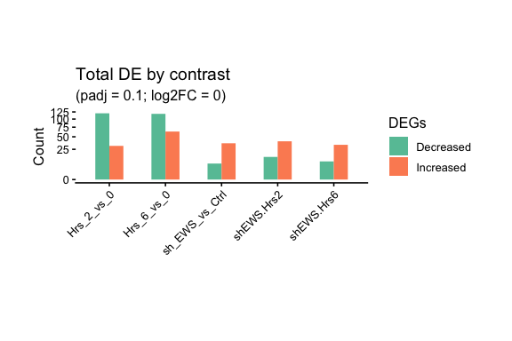

Sample-wise Pathway Activity with HotgeneSets
================

## Overview

`HotgeneSets()` computes pathway-level activity scores for each sample
(using GSVA/ssGSEA-family methods) and returns a new Hotgenes object.
This keeps pathway activity analysis separate from the Shiny workflow
and makes it easy to reuse downstream plotting and DE utilities on
pathway features.

``` r
library(Hotgenes)

fit_Hotgenes <- readRDS(
  system.file("extdata", "fit_Hotgenes.RDS",
              package = "Hotgenes",
              mustWork = TRUE)
)
```

------------------------------------------------------------------------

## 1. Retrieve Gene Sets

``` r
H_paths <- msigdbr_wrapper(
  species  = "human",
  set      = c("CP:KEGG_MEDICUS"),
  gene_col = "gene_symbol"
)

length(H_paths)
## [1] 658
names(H_paths)[1:5]
## [1] "kegg_medicus_env_factor_arsenic_to_electron_transfer_in_complex_iv"        
## [2] "kegg_medicus_env_factor_benzo_a_pyrenre_to_cyp_mediated_metabolism"        
## [3] "kegg_medicus_env_factor_dce_to_dna_adducts"                                
## [4] "kegg_medicus_env_factor_e2_to_nuclear_initiated_estrogen_signaling_pathway"
## [5] "kegg_medicus_env_factor_e2_to_ras_erk_signaling_pathway"
```

------------------------------------------------------------------------

## 2. Compute Sample-wise Pathway Activity

``` r
HotgeneSets_out <- HotgeneSets(
  Hotgenes = fit_Hotgenes,
  geneSets = H_paths,
  kcdf     = "Gaussian",
  method   = "ssgsea",
  minSize  = 2,
  maxSize  = Inf
)

HotgeneSets_out
## class: Hotgenes 
## Original class/package:  EList/limma
## 
## Differential expression (default thresholds): 
## |contrast       | total|
## |:--------------|-----:|
## |Hrs_2_vs_0     |   151|
## |Hrs_6_vs_0     |   181|
## |sh_EWS_vs_Ctrl |    43|
## |shEWS.Hrs2     |    54|
## |shEWS.Hrs6     |    42|
## 
## Available feature mapping:  Feature, original_features, size 
## ExpressionSlots:  ssgsea 
## Total auxiliary assays:  0 
## Total samples:  12
```

The resulting object stores pathway scores in the expression slot and
supports the same downstream functions used for gene-level analyses.

------------------------------------------------------------------------

## 3. Explore Pathway-level Differential Activity

``` r
DEPlot(HotgeneSets_out, .log2FoldChange = 0, padj_cut = 0.1)
```

<!-- -->

``` r
DEphe(
  HotgeneSets_out,
  contrasts         = "sh_EWS_vs_Ctrl",
  Topn              = 5,
  annotations       = c("Hrs", "sh"),
  annotation_colors = coldata_palettes(HotgeneSets_out)
)
```

------------------------------------------------------------------------

## 4. Retrieve Leading Pathway Names for Downstream Use

``` r
pathway_hits <- HotgeneSets_out |>
  DE(
    Report    = "Features",
    contrasts = "sh_EWS_vs_Ctrl",
    padj_cut  = 0.2
  )

head(pathway_hits$sh_EWS_vs_Ctrl)
## [1] "kegg_medicus_variant_mutation_inactivated_runx1_to_transcription"           
## [2] "kegg_medicus_variant_tel_aml1_fusion_to_transcriptional_repression"         
## [3] "kegg_medicus_reference_egf_jak_stat_signaling_pathway"                      
## [4] "kegg_medicus_reference_mlk_jnk_signaling_pathway"                           
## [5] "kegg_medicus_variant_erbb2_overexpression_to_egf_jak_stat_signaling_pathway"
## [6] "kegg_medicus_pathogen_htlv_1_tax_to_tnf_jnk_signaling_pathway"
```

These pathway names can be used directly in additional plots, reporting,
or to initialize a focused Shiny session if needed.
