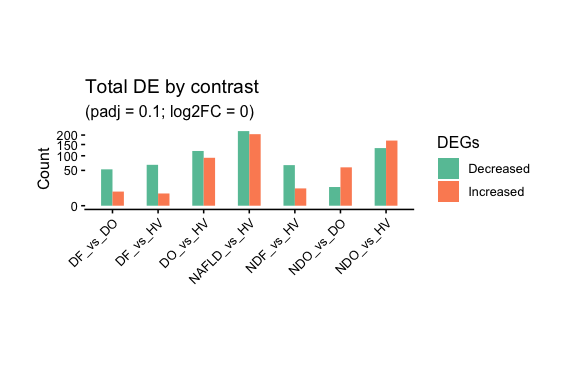
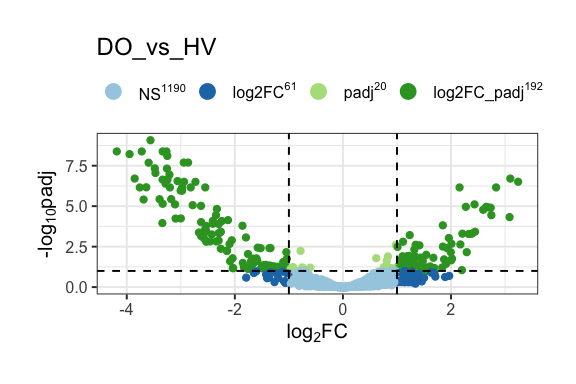
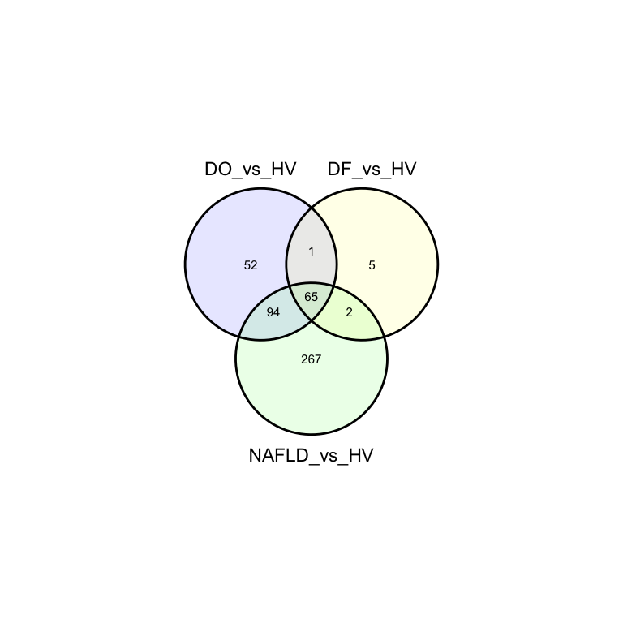
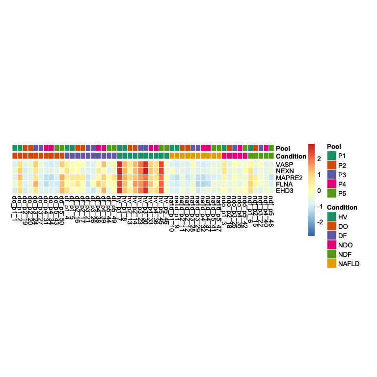
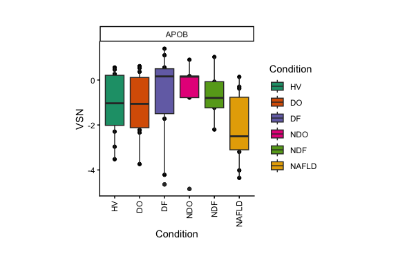

DILI Discovery Proteomics with Hotgenes
================

## Building a Hotgenes Object from DILI Discovery Proteomics Data

This vignette demonstrates how to build a Hotgenes object from the
Drug-Induced Liver Injury (DILI) discovery proteomics dataset published
in:

> Ravindra, K.C., Vaidya, V.S., Wang, Z. et al. *Tandem mass tag-based
> quantitative proteomic profiling identifies candidate serum biomarkers
> of drug-induced liver injury in humans* **Nat Commun**, 14, 1215
> (2023). <https://doi.org/10.1038/s41467-023-36858-6>

The raw data are publicly deposited in MassIVE under accession
**MSV000089782**. A pre-parsed snapshot is shipped with this package as
`inst/extdata/dili_raw.RDS` to avoid a runtime download.

### A note on private metadata

The original analysis used two variables from the private metadata file
`1219_p1-p5_protein_KEY.xlsx` that are **not** available in the public
deposit:

1.  **subject** – patient identifier, used with `duplicateCorrelation()`
    to control for repeated measures (paired DO/DF samples from the same
    patient). Without subject IDs this blocking step is omitted here.

2.  **channel** – exact TMT channel label (e.g. `126C`, `127N`) within
    each pool, used with `voomaByGroup()` to compensate for
    channel-specific variance. `Pool` (P1–P5) is used as a proxy because
    it captures the dominant source of TMT batch variance.

All other analytical steps — VSN normalization, `voomaByGroup`, robust
`lmFit`, and a BH-adjusted p-value threshold of 0.1 — reproduce those
described in Federspiel et al.

## Step 1 — Load data

`dili_raw.RDS` is a pre-parsed snapshot of the public MassIVE deposit
(MSV000089782), saved to `inst/extdata` to avoid a runtime download.

``` r
library(Hotgenes)

raw_df <- readRDS(
  system.file("extdata", "dili_raw.RDS",
              package = "Hotgenes",
              mustWork = TRUE)
)
```

To re-download and refresh `dili_raw.RDS` directly from MassIVE, run the
following block once (set `eval = FALSE` to skip during package build):

``` r
url <- paste0(
  "https://massive.ucsd.edu/ProteoSAFe/DownloadResultFile?",
  "file=f.MSV000089782%2Fupdates%2F2023-02-28_jfederspiel_1bc96582",
  "%2Fother%2FDILI_discovery_data.xlsx&forceDownload=true"
)

tmp <- tempfile(fileext = ".xlsx")
download.file(url, tmp, mode = "wb")

# Requires readxl and janitor packages (install if needed):
# install.packages(c("readxl", "janitor"))
raw_df <- readxl::read_excel(tmp) |>
  janitor::clean_names()

saveRDS(
  raw_df,
  file = file.path(getwd(), "inst", "extdata", "dili_raw.RDS")
)
```

## Step 2 — Identify sample columns

Sample columns follow the pattern `<condition>_p<pool>_<number>` where
condition is one of `do`, `df`, `hv`, `nafld`, `ndo`, or `ndf`.

``` r
sample_cols <- colnames(raw_df)[
  grepl("^(do|df|hv|nafld|ndo|ndf)_", colnames(raw_df))
]

length(sample_cols)
## [1] 50
head(sample_cols)
## [1] "do_p1_1"  "do_p1_2"  "do_p2_19" "do_p2_20" "do_p3_24" "do_p3_27"
```

## Step 3 — Filter proteins

Retain only:

- Reviewed UniProt entries (accession starts with `sp|`)
- Proteins that are not contaminants
- Proteins quantified with at least one peptide (`min_peps > 0`)

Unique gene symbols are generated as the `Feature` column, which is
required downstream for GSEA.

``` r
filtered_exps <- raw_df |>
  dplyr::filter(!grepl("contaminant", .data$protein)) |>
  dplyr::filter(grepl("^sp[|]", .data$protein)) |>
  dplyr::filter(.data$min_peps > 0) |>
  dplyr::mutate(Feature = make.names(.data$gene_symbol, unique = TRUE))

nrow(filtered_exps)
## [1] 1463
```

## Step 4 — Build the expression matrix

``` r
expr_matrix <- filtered_exps |>
  dplyr::select("Feature", dplyr::any_of(sample_cols)) |>
  tibble::column_to_rownames("Feature") |>
  as.matrix()

dim(expr_matrix)
## [1] 1463   50
```

## Step 5 — Build the protein ID mapper

The mapper links `Feature` names back to the original gene symbol, full
protein accession, and description. Hotgenes functions use the mapper to
display human-readable labels in plots and tables.

``` r
mapper_df <- filtered_exps |>
  dplyr::select(
    "Feature",
    "Gene"        = "gene_symbol",
    "Protein"     = "protein",
    "Description" = "description"
  )

head(mapper_df)
## # A tibble: 6 × 4
##   Feature  Gene     Protein                   Description                                                 
##   <chr>    <chr>    <chr>                     <chr>                                                       
## 1 IGLV4.69 IGLV4-69 sp|A0A075B6H9|LV469_HUMAN Immunoglobulin lambda variable 4-69 OS=Homo sapiens GN=IGLV…
## 2 IGLV4.60 IGLV4-60 sp|A0A075B6I1|LV460_HUMAN Immunoglobulin lambda variable 4-60 OS=Homo sapiens GN=IGLV…
## 3 IGLV3.16 IGLV3-16 sp|A0A075B6K0|LV316_HUMAN Immunoglobulin lambda variable 3-16 OS=Homo sapiens GN=IGLV…
## 4 IGLV3.10 IGLV3-10 sp|A0A075B6K4|LV310_HUMAN Immunoglobulin lambda variable 3-10 OS=Homo sapiens GN=IGLV…
## 5 IGLV3.9  IGLV3-9  sp|A0A075B6K5|LV39_HUMAN  Immunoglobulin lambda variable 3-9 OS=Homo sapiens GN=IGLV3…
## # ℹ 1 more row
```

## Step 6 — Build sample metadata (coldata)

Condition and pool are parsed from the sample column names.  
`Condition` levels are ordered so that healthy volunteers (`HV`) appear
first.

``` r
coldata <- data.frame(
  Sample    = sample_cols,
  Condition = toupper(sub("_p[0-9]+_[0-9]+$", "", sample_cols)),
  Pool      = toupper(sub(".*_(p[0-9]+)_.*", "\\1", sample_cols)),
  row.names = sample_cols,
  stringsAsFactors = TRUE
)

coldata[["Condition"]] <- factor(
  coldata[["Condition"]],
  levels = c("HV", "DO", "DF", "NDO", "NDF", "NAFLD")
)

table(coldata$Condition)
## 
##    HV    DO    DF   NDO   NDF NAFLD 
##    10    10    10     5     5    10
```

## Step 7 — VSN normalization

Variance-stabilising normalisation (`limma::normalizeVSN`) is applied to
correct for intensity-dependent variance across the dynamic range of the
TMT measurements. Missing values are replaced with 0 before
normalisation.

``` r
expr_matrix[is.na(expr_matrix)] <- 0
expr_matrix_vsn <- limma::normalizeVSN(expr_matrix)
## vsn2: 1463 x 50 matrix (1 stratum).
## Please use 'meanSdPlot' to verify the fit.
```

## Step 8 — Design matrix

A no-intercept design matrix is constructed so that each coefficient
directly represents the mean VSN-normalised expression for one
condition, making contrasts straightforward to specify.

``` r
design <- model.matrix(~ 0 + Condition, data = coldata)
colnames(design) <- gsub("Condition", "", colnames(design))

head(design)
##          HV DO DF NDO NDF NAFLD
## do_p1_1   0  1  0   0   0     0
## do_p1_2   0  1  0   0   0     0
## do_p2_19  0  1  0   0   0     0
## do_p2_20  0  1  0   0   0     0
## do_p3_24  0  1  0   0   0     0
## do_p3_27  0  1  0   0   0     0
```

## Step 9 — voomaByGroup transformation

`limma::voomaByGroup` estimates mean–variance trends separately for each
TMT pool and converts the VSN-normalised intensities into precision
weights for downstream linear modelling. `Pool` is used as the grouping
variable because it captures the dominant source of batch variance in
the public deposit.

``` r
vm_exp <- limma::voomaByGroup(
  y      = expr_matrix_vsn,
  group  = coldata[["Pool"]],
  design = design,
  plot   = FALSE
)
```

## Step 10 — Robust linear model fit

`limma::lmFit` with `method = "robust"` downweights outlier samples when
estimating per-protein coefficients, improving robustness against
occasional poorly quantified channels.

Note: `duplicateCorrelation()` is omitted here because the patient
subject IDs required to model repeated measures (paired DO/DF samples)
are not available in the public deposit.

``` r
fit <- limma::lmFit(
  vm_exp,
  design,
  method = "robust"
)
## Warning in rlm.default(x = X, y = y, weights = w, ...): 'rlm' failed to converge in 20 steps
## Warning in rlm.default(x = X, y = y, weights = w, ...): 'rlm' failed to converge in 20 steps
## Warning in rlm.default(x = X, y = y, weights = w, ...): 'rlm' failed to converge in 20 steps
## Warning in rlm.default(x = X, y = y, weights = w, ...): 'rlm' failed to converge in 20 steps
## Warning in rlm.default(x = X, y = y, weights = w, ...): 'rlm' failed to converge in 20 steps
## Warning in rlm.default(x = X, y = y, weights = w, ...): 'rlm' failed to converge in 20 steps
## Warning in rlm.default(x = X, y = y, weights = w, ...): 'rlm' failed to converge in 20 steps
## Warning in rlm.default(x = X, y = y, weights = w, ...): 'rlm' failed to converge in 20 steps
## Warning in rlm.default(x = X, y = y, weights = w, ...): 'rlm' failed to converge in 20 steps
## Warning in rlm.default(x = X, y = y, weights = w, ...): 'rlm' failed to converge in 20 steps
## Warning in rlm.default(x = X, y = y, weights = w, ...): 'rlm' failed to converge in 20 steps
## Warning in rlm.default(x = X, y = y, weights = w, ...): 'rlm' failed to converge in 20 steps
## Warning in rlm.default(x = X, y = y, weights = w, ...): 'rlm' failed to converge in 20 steps
## Warning in rlm.default(x = X, y = y, weights = w, ...): 'rlm' failed to converge in 20 steps
```

## Step 11 — Define contrasts and run eBayes

Seven clinically motivated contrasts are tested, all relative to healthy
volunteers (`HV`), plus one intra-DILI comparison (`DF_vs_DO`) and one
cross-group comparison (`NDO_vs_DO`).

``` r
contrasts_mat <- limma::makeContrasts(
  DO_vs_HV    = DO    - HV,
  DF_vs_HV    = DF    - HV,
  NDO_vs_HV   = NDO   - HV,
  NDF_vs_HV   = NDF   - HV,
  NAFLD_vs_HV = NAFLD - HV,
  DF_vs_DO    = DF    - DO,
  NDO_vs_DO   = NDO   - DO,
  levels = design
)

fit2 <- limma::contrasts.fit(fit, contrasts_mat)
fit2 <- limma::eBayes(fit2)
```

## Step 12 — Create the Hotgenes object

All upstream objects are bundled into a single `Hotgenes` object using
`Hotgeneslimma()`. The raw log2-transformed matrix is stored as an
auxiliary assay so it is available for alternative visualizations.

``` r
dili_hotgenes <- Hotgeneslimma(
  limmafit        = fit2,
  coldata         = coldata,
  Expression      = vm_exp,
  Expression_name = "VSN",
  Exps_list       = list(log2 = log2(expr_matrix + 1)),
  Mapper          = mapper_df
)

dili_hotgenes
## class: Hotgenes 
## Original class/package:  EList/limma
## 
## Differential expression (default thresholds): 
## |contrast    | total|
## |:-----------|-----:|
## |DF_vs_DO    |    61|
## |DF_vs_HV    |    73|
## |DO_vs_HV    |   212|
## |NAFLD_vs_HV |   428|
## |NDF_vs_HV   |    78|
## |NDO_vs_DO   |    73|
## |NDO_vs_HV   |   303|
## 
## Available feature mapping:  Feature, Gene, Protein, Description 
## ExpressionSlots:  VSN, log2 
## Total auxiliary assays:  0 
## Total samples:  50
```

## What can you do with the DILI Hotgenes object?

### Summary of differentially expressed proteins

``` r
DE(dili_hotgenes, Topn = 5)
## $DF_vs_DO
## # A tibble: 5 × 14
##   Feature contrast_dir  baseMean log2FoldChange     FC  stat   pvalue       padj     t     B Gene  Protein
##   <chr>   <chr>            <dbl>          <dbl>  <dbl> <dbl>    <dbl>      <dbl> <dbl> <dbl> <chr> <chr>  
## 1 HPD     DF_vs_DO_down    -3.19          -3.51 0.0875 -8.23 8.90e-11    1.30e-7 -8.23 14.3  HPD   sp|P32…
## 2 GPT     DF_vs_DO_down    -2.96          -3.62 0.0814 -7.79 4.18e-10    3.06e-7 -7.79 12.9  GPT   sp|P24…
## 3 AMDHD1  DF_vs_DO_down    -3.32          -3.09 0.118  -7.34 2.01e- 9    9.79e-7 -7.34 11.4  AMDH… sp|Q96…
## 4 GOT1    DF_vs_DO_down    -2.51          -2.57 0.168  -6.42 5.29e- 8    1.93e-5 -6.42  8.29 GOT1  sp|P17…
## 5 ECI1    DF_vs_DO_down    -2.83          -3.68 0.0780 -6.27 9.21e- 8    2.69e-5 -6.27  7.77 ECI1  sp|P42…
## # ℹ 2 more variables: Description <chr>, significant <chr>
## 
## $DF_vs_HV
## # A tibble: 5 × 14
##   Feature contrast_dir  baseMean log2FoldChange    FC  stat       pvalue    padj     t     B Gene  Protein
##   <chr>   <chr>            <dbl>          <dbl> <dbl> <dbl>        <dbl>   <dbl> <dbl> <dbl> <chr> <chr>  
## 1 VASP    DF_vs_HV_down    -2.85          -2.79 0.145 -7.48      1.22e-9 1.17e-6 -7.48 11.9  VASP  sp|P50…
## 2 NEXN    DF_vs_HV_down    -3.12          -3.04 0.121 -7.41      1.60e-9 1.17e-6 -7.41 11.6  NEXN  sp|Q0Z…
## 3 CAVIN2  DF_vs_HV_down    -3.25          -3.09 0.117 -6.84      1.22e-8 4.45e-6 -6.84  9.70 CAVI… sp|O95…
## 4 PDLIM5  DF_vs_HV_down    -2.83          -2.51 0.176 -6.85      1.16e-8 4.45e-6 -6.85  9.74 PDLI… sp|Q96…
## 5 EEF1G   DF_vs_HV_down    -2.84          -2.78 0.146 -6.57      3.12e-8 6.53e-6 -6.57  8.80 EEF1G sp|P26…
## # ℹ 2 more variables: Description <chr>, significant <chr>
## 
## $DO_vs_HV
## # A tibble: 5 × 14
##   Feature contrast_dir  baseMean log2FoldChange     FC  stat   pvalue     padj     t     B Gene   Protein 
##   <chr>   <chr>            <dbl>          <dbl>  <dbl> <dbl>    <dbl>    <dbl> <dbl> <dbl> <chr>  <chr>   
## 1 VASP    DO_vs_HV_down    -2.85          -3.56 0.0847 -9.70 5.77e-13 8.44e-10 -9.70  19.3 VASP   sp|P505…
## 2 FLNA    DO_vs_HV_down    -2.31          -3.27 0.104  -8.80 1.21e-11 4.17e- 9 -8.80  16.4 FLNA   sp|P213…
## 3 NEXN    DO_vs_HV_down    -3.12          -3.72 0.0757 -8.95 7.30e-12 4.17e- 9 -8.95  16.8 NEXN   sp|Q0ZG…
## 4 MAPRE2  DO_vs_HV_down    -2.18          -4.18 0.0550 -8.83 1.12e-11 4.17e- 9 -8.83  16.5 MAPRE2 sp|Q155…
## 5 EHD3    DO_vs_HV_down    -2.99          -3.34 0.0991 -8.75 1.42e-11 4.17e- 9 -8.75  16.2 EHD3   sp|Q9NZ…
## # ℹ 2 more variables: Description <chr>, significant <chr>
## 
## $NAFLD_vs_HV
## # A tibble: 5 × 14
##   Feature contrast_dir  baseMean log2FoldChange     FC   stat   pvalue     padj      t     B Gene  Protein
##   <chr>   <chr>            <dbl>          <dbl>  <dbl>  <dbl>    <dbl>    <dbl>  <dbl> <dbl> <chr> <chr>  
## 1 VASP    NAFLD_vs_HV_…    -2.85          -3.99 0.0628 -11.1  5.13e-15 7.51e-12 -11.1   23.8 VASP  sp|P50…
## 2 FLNA    NAFLD_vs_HV_…    -2.31          -3.77 0.0731 -10.00 2.15e-13 1.18e-10 -10.00  20.3 FLNA  sp|P21…
## 3 TWF2    NAFLD_vs_HV_…    -2.41          -3.45 0.0917  -9.88 3.11e-13 1.18e-10  -9.88  19.9 TWF2  sp|Q6I…
## 4 PDLIM5  NAFLD_vs_HV_…    -2.83          -3.48 0.0894  -9.87 3.22e-13 1.18e-10  -9.87  19.9 PDLI… sp|Q96…
## 5 NEXN    NAFLD_vs_HV_…    -3.12          -3.94 0.0653  -9.75 4.87e-13 1.19e-10  -9.75  19.5 NEXN  sp|Q0Z…
## # ℹ 2 more variables: Description <chr>, significant <chr>
## 
## $NDF_vs_HV
## # A tibble: 5 × 14
##   Feature contrast_dir   baseMean log2FoldChange     FC  stat   pvalue      padj     t     B Gene  Protein
##   <chr>   <chr>             <dbl>          <dbl>  <dbl> <dbl>    <dbl>     <dbl> <dbl> <dbl> <chr> <chr>  
## 1 CAVIN2  NDF_vs_HV_down    -3.25          -3.87 0.0684 -7.12 4.42e- 9   1.29e-6 -7.12  10.6 CAVI… sp|O95…
## 2 VASP    NDF_vs_HV_down    -2.85          -3.21 0.108  -7.25 2.77e- 9   1.29e-6 -7.25  11.1 VASP  sp|P50…
## 3 NEXN    NDF_vs_HV_down    -3.12          -3.62 0.0813 -7.16 3.81e- 9   1.29e-6 -7.16  10.8 NEXN  sp|Q0Z…
## 4 CTTN    NDF_vs_HV_down    -2.77          -4.10 0.0583 -7.28 2.48e- 9   1.29e-6 -7.28  11.2 CTTN  sp|Q14…
## 5 PDLIM5  NDF_vs_HV_down    -2.83          -3.31 0.101  -7.55 9.50e-10   1.29e-6 -7.55  12.1 PDLI… sp|Q96…
## # ℹ 2 more variables: Description <chr>, significant <chr>
## 
## $NDO_vs_DO
## # A tibble: 5 × 14
##   Feature contrast_dir baseMean log2FoldChange    FC  stat   pvalue         padj     t     B Gene  Protein
##   <chr>   <chr>           <dbl>          <dbl> <dbl> <dbl>    <dbl>        <dbl> <dbl> <dbl> <chr> <chr>  
## 1 CPS1    NDO_vs_DO_up    -3.56           3.86 14.6   8.93 7.86e-12 0.0000000115  8.93 16.5  CPS1  sp|P31…
## 2 UGP2    NDO_vs_DO_up    -3.40           4.36 20.5   7.01 6.55e- 9 0.00000479    7.01 10.2  UGP2  sp|Q16…
## 3 ACAA2   NDO_vs_DO_up    -3.20           3.79 13.8   6.87 1.09e- 8 0.00000530    6.87  9.75 ACAA2 sp|P42…
## 4 PSAT1   NDO_vs_DO_up    -2.82           3.26  9.59  5.89 3.51e- 7 0.000128      5.89  6.49 PSAT1 sp|Q9Y…
## 5 ACAA1   NDO_vs_DO_up    -3.11           3.64 12.5   5.57 1.09e- 6 0.000318      5.57  5.43 ACAA1 sp|P09…
## # ℹ 2 more variables: Description <chr>, significant <chr>
## 
## $NDO_vs_HV
## # A tibble: 5 × 14
##   Feature contrast_dir baseMean log2FoldChange    FC  stat   pvalue     padj     t     B Gene   Protein   
##   <chr>   <chr>           <dbl>          <dbl> <dbl> <dbl>    <dbl>    <dbl> <dbl> <dbl> <chr>  <chr>     
## 1 CPS1    NDO_vs_HV_up    -3.56           4.47  22.2 10.4  6.07e-14 5.42e-11 10.4   21.3 CPS1   sp|P31327…
## 2 AMDHD1  NDO_vs_HV_up    -3.32           5.41  42.6 10.3  7.41e-14 5.42e-11 10.3   21.1 AMDHD1 sp|Q96NU7…
## 3 HPD     NDO_vs_HV_up    -3.19           5.48  44.7 10.0  1.95e-13 9.51e-11 10.0   20.1 HPD    sp|P32754…
## 4 ALDH2   NDO_vs_HV_up    -2.77           4.94  30.7  9.19 3.17e-12 1.16e- 9  9.19  17.5 ALDH2  sp|P05091…
## 5 ACAA2   NDO_vs_HV_up    -3.20           4.81  28.1  8.78 1.29e-11 3.76e- 9  8.78  16.3 ACAA2  sp|P42765…
## # ℹ 2 more variables: Description <chr>, significant <chr>
```

### Overview plot of all contrasts

``` r
DEPlot(dili_hotgenes, .log2FoldChange = 0, padj_cut = 0.1)
```

<!-- -->

### Volcano plot

``` r
VPlot(dili_hotgenes,
      .log2FoldChange = 1, padj_cut = 0.1,
      contrasts = "DO_vs_HV")
```

<!-- -->

### Venn diagram of overlapping hits

``` r
dili_hotgenes |>
  DE(
    Report     = "Features",
    contrasts  = c("DO_vs_HV", "DF_vs_HV", "NAFLD_vs_HV"),
    .log2FoldChange = 0, padj_cut = 0.1
  ) |>
  Venn_Report()
## Coordinate system already present.
## ℹ Adding new coordinate system, which will replace the existing one.
## $vennD
```

<!-- -->

    ## 
    ## $Intsect
    ## $Intsect$DF_vs_HV
    ## [1] "MADCAM1" "DMKN"    "ADAM22"  "GLA"     "GM2A"   
    ## 
    ## $Intsect$DO_vs_HV
    ##  [1] "GPT"      "CEACAM1"  "AMDHD1"   "ALPL"     "ECI1"     "NECTIN3"  "DDTL"     "ASL"      "ECHDC2"  
    ## [10] "ANPEP"    "THOP1"    "ADGRG6"   "F11R"     "NT5E"     "PCDHGC3"  "MAN1A1"   "ASS1"     "DCXR"    
    ## [19] "DMGDH"    "SLC39A14" "CADM1"    "DCBLD1"   "MYRF"     "BHMT"     "OTC"      "CCM2"     "FAH"     
    ## [28] "EPHA1"    "NECTIN2"  "MDH2"     "SMPD1"    "LEPR"     "GPLD1"    "OAF"      "ADH1A"    "CTSS"    
    ## [37] "CHST12"   "GALNT4"   "GRHPR"    "SUSD5"    "XPNPEP2"  "INSR"     "LAMP2"    "GGH"      "RTN4R"   
    ## [46] "HPX"      "PCDH1"    "GSTA1"    "PCK2"     "MARCO"    "BASP1"    "RTN4RL2" 
    ## 
    ## $Intsect$NAFLD_vs_HV
    ##   [1] "ADAMTSL2"   "CALU"       "PPBP"       "APP"        "FLNC"       "PCDH9"      "C7"        
    ##   [8] "ADA2"       "FUT11"      "PRCP"       "PTGR1"      "CD97"       "ITGA5"      "ARPC1B"    
    ##  [15] "ILK"        "NFASC"      "PLXNB2"     "EPHA7"      "ACTC1"      "PABPC1"     "VCAM1"     
    ##  [22] "AGRN"       "NRCAM"      "MRC2"       "HMCN1"      "ROBO1"      "GBE1"       "CNTN4"     
    ##  [29] "COL6A1"     "CDH6"       "CNTN5"      "CSF1R"      "ERVMER34.1" "NHLRC3"     "TNNC2"     
    ##  [36] "SERPINE1"   "NID1"       "MFAP4"      "FGL2"       "SEMA7A"     "CMPK1"      "TXNRD1"    
    ##  [43] "GPD1"       "ARPC5"      "ITGA4"      "JAG1"       "SEMA4B"     "ITGB2"      "STX7"      
    ##  [50] "NEO1"       "GP5"        "CES1"       "CD163"      "CLIC4"      "SRGN"       "CBLN4"     
    ##  [57] "INHBE"      "SDC4"       "XYLT2"      "GGT5"       "ACP2"       "LEAP2"      "TGFB1"     
    ##  [64] "SEMA6A"     "YWHAZ"      "ITGB1"      "CD109"      "SERPINB9"   "ANGPTL8"    "YWHAH"     
    ##  [71] "CES2"       "RSU1"       "OIT3"       "SPP2"       "COLEC11"    "ERP29"      "ICAM3"     
    ##  [78] "AXL"        "SEMA6D"     "DDR1"       "PLA2G15"    "EXT1"       "CDHR2"      "DMTN"      
    ##  [85] "QDPR"       "ARPC2"      "FDPS"       "CDH11"      "LTBP1"      "ECM1"       "HEXA"      
    ##  [92] "VIM"        "MSN"        "CAPZA1"     "VCL"        "PROZ"       "VGF"        "BCAM"      
    ##  [99] "EXT2"       "PPIA"       "TNFRSF14"   "DYNLL2"     "COLEC10"    "PTPRK"      "CPQ"       
    ## [106] "CHI3L1"     "NID2"       "AOC3"       "FCMR"       "CD33"       "ACTG1"      "CLN5"      
    ## [113] "DCBLD2"     "EFNB1"      "LY75"       "SFN"        "ARHGAP1"    "ANG"        "PTK7"      
    ## [120] "SBSN"       "ART4"       "CR1"        "SEMA3G"     "LCN2"       "SEMA3A"     "CTSA"      
    ## [127] "SPINK5"     "CAPZA2"     "ACTR2"      "BST1"       "IMPAD1"     "UNC5C"      "MEGF8"     
    ## [134] "SULF2"      "PAPLN"      "MMP3"       "GALNS"      "APOM"       "HNRNPC"     "LILRA3"    
    ## [141] "LGALS3BP"   "GOLM1"      "LNPEP"      "MLEC"       "STMN1"      "PF4V1"      "YWHAB"     
    ## [148] "CFHR5"      "PROC"       "PDGFB"      "PLEC"       "ITGA1"      "ACTR3"      "APLP1"     
    ## [155] "ROBO2"      "CD84"       "JAG2"       "PAK1"       "B3GAT3"     "ENDOD1"     "WFDC1"     
    ## [162] "WFIKKN2"    "GALNT6"     "ENPP4"      "ECM2"       "IGFBP5"     "SPINT1"     "PLXND1"    
    ## [169] "NRP1"       "PTPRC"      "BTN2A1"     "ME1"        "IGF1"       "OSMR"       "COL14A1"   
    ## [176] "LYVE1"      "FGFR4"      "TNFRSF21"   "IL1RL1"     "NOTCH3"     "CNTN3"      "PCMT1"     
    ## [183] "TREH"       "MAN1C1"     "EFEMP1"     "ARPC4"      "APOD"       "HLA.DRA"    "CD48"      
    ## [190] "ADAMTS2"    "RECK"       "LPL"        "STIP1"      "CD300A"     "LAMA5"      "TXN"       
    ## [197] "GALNT10"    "GANAB"      "PRAP1"      "PODXL"      "PGLS"       "MERTK"      "SIGLEC14"  
    ## [204] "PCYOX1"     "QSOX1"      "PON1"       "SELE"       "PCDH12"     "MANBA"      "CP"        
    ## [211] "F12"        "MYLK"       "F5"         "ADA"        "LILRA6"     "TEK"        "TYRO3"     
    ## [218] "IFNAR2"     "EFEMP2"     "ATP1B1"     "PPIB"       "PSMB6"      "HSPA13"     "LOXL3"     
    ## [225] "LAMB2"      "DPP7"       "SERPINA10"  "ESAM"       "SERPINB1"   "LRRC25"     "B3GNT2"    
    ## [232] "ACAA2"      "HEG1"       "MMRN1"      "PF4"        "CST6"       "CLIC1"      "AGA"       
    ## [239] "F13A1"      "ICOSLG"     "UGP2"       "CSF2RA"     "NECTIN1"    "GNPTG"      "CFL2"      
    ## [246] "IGFBP7"     "CASC4"      "INHBA"      "PYCARD"     "PDGFRA"     "FBN1"       "GCLM"      
    ## [253] "NTRK2"      "F2"         "KYNU"       "VTN"        "IGF2"       "SERPINF1"   "FCGBP"     
    ## [260] "F13B"       "OLFM1"      "CPN2"       "LEP"        "CFP"        "HSPA4"      "IGFBP3"    
    ## [267] "PCDH18"    
    ## 
    ## $Intsect$`DF_vs_HV:NAFLD_vs_HV`
    ## [1] "EIF4H" "PDIA6"
    ## 
    ## $Intsect$`DO_vs_HV:DF_vs_HV`
    ## [1] "FTH1"
    ## 
    ## $Intsect$`DO_vs_HV:NAFLD_vs_HV`
    ##  [1] "HPD"      "FERMT3"   "ALDH2"    "GOT1"     "ALDH1A1"  "RIDA"     "AGXT"     "GRB2"     "PLEK"    
    ## [10] "FCAMR"    "ACTN1"    "ALCAM"    "ALDOB"    "MMP8"     "GP6"      "FGA"      "LCP2"     "DLD"     
    ## [19] "PCBP1"    "HMGCS1"   "HSPE1"    "GSR"      "SNX12"    "MYDGF"    "ITGB3"    "PARVB"    "TUBA4A"  
    ## [28] "TCN1"     "ACTN4"    "CDH2"     "IL6ST"    "ITGAL"    "GDA"      "TREML1"   "THBS1"    "GAS6"    
    ## [37] "GMFB"     "HPSE"     "PRDX5"    "ERBB2"    "CPM"      "IFNAR1"   "IDH1"     "CAMP"     "GMFG"    
    ## [46] "MTPN"     "GP1BA"    "LIMS1"    "LILRA2"   "HIBADH"   "SIRPA"    "UBE2L3"   "CFL1"     "PSAT1"   
    ## [55] "ACAT2"    "SH3BGRL"  "APLP2"    "PTGES3"   "GSTP1"    "CTSZ"     "ACO1"     "PRKAR1A"  "MMP9"    
    ## [64] "CALM2"    "WDR1"     "LRP11"    "ACAA1"    "SNX3"     "SELP"     "WBP2"     "DPYD"     "EGF"     
    ## [73] "FHL1"     "UPB1"     "PLBD2"    "EIF3J"    "HNRNPK"   "RAD23B"   "SERPING1" "UBE2I"    "DBI"     
    ## [82] "SNCA"     "SOD2"     "GAA"      "CORO1A"   "ST3GAL6"  "FOLR2"    "ADGRL2"   "CRYZ"     "LMAN2"   
    ## [91] "ARHGDIA"  "HEXB"     "SCARF1"   "ST14"    
    ## 
    ## $Intsect$`DO_vs_HV:DF_vs_HV:NAFLD_vs_HV`
    ##  [1] "VASP"     "FLNA"     "NEXN"     "MAPRE2"   "EHD3"     "CTTN"     "DBNL"     "TWF2"     "PDLIM5"  
    ## [10] "CAVIN2"   "TUBB1"    "RAB11B"   "CALD1"    "TPM4"     "ZYX"      "SNAP23"   "CAP1"     "LASP1"   
    ## [19] "EEF1G"    "MYL12B"   "SH3BGRL3" "ABI1"     "PDLIM1"   "PFN1"     "BIN2"     "CRKL"     "MAPRE1"  
    ## [28] "CORO1C"   "SH3BGRL2" "TAGLN2"   "SKAP2"    "MAPRE3"   "LY6G6F"   "DIAPH1"   "PDLIM7"   "VAPA"    
    ## [37] "TPM1"     "VNN1"     "MYL6"     "LGALSL"   "CSRP1"    "MYH9"     "TMSB10"   "ARHGDIB"  "CNN2"    
    ## [46] "TLN1"     "COTL1"    "TPM3"     "TPT1"     "DBN1"     "FYB1"     "SPN"      "RGS10"    "TUBA1A"  
    ## [55] "TUBB4B"   "RAB14"    "ARHGAP18" "SLC9A3R1" "WDR44"    "TMOD3"    "ITGA2B"   "ARF3"     "CNTFR"   
    ## [64] "HSPB1"    "CTSW"    
    ## 
    ## 
    ## $Names
    ## [1] "DF_vs_HV:NAFLD_vs_HV"          "DO_vs_HV:DF_vs_HV"             "DO_vs_HV:NAFLD_vs_HV"         
    ## [4] "DO_vs_HV:DF_vs_HV:NAFLD_vs_HV"

### Heatmap of top hits

``` r
DEphe(dili_hotgenes,
      contrasts  = "DO_vs_HV",
      Topn       = 5,
      cellheight = 10,
      cellwidth  = 8,
      annotation_colors = coldata_palettes(dili_hotgenes),
      annotations = c("Condition", "Pool"))
```

<!-- -->

### Expression plots

``` r
ExpsPlot(dili_hotgenes,
  xVar    = "Condition",
  yVar    = c("APOB", "ALB"),
  fill    = "Condition",
  boxplot = TRUE
)
```

<!-- -->

### GSEA with KEGG pathways

``` r
# Get KEGG gene sets
H_paths <- msigdbr_wrapper(
  species  = "human",
  set      = "CP:KEGG_MEDICUS",
  gene_col = "gene_symbol"
)

# Rank genes for the DO_vs_HV contrast
InputRanks <- dili_hotgenes |>
  DE(
    Report    = "Ranks",
    contrasts = "DO_vs_HV",
    Rank_name = "Gene",
    padj_cut  = 0.1
  )

# Run fgsea
Out_GSEA <- fgsea_(
  Ranks    = InputRanks,
  pathways = H_paths,
  nproc    = 1,
  minSize  = 5,
  maxSize  = Inf
)
##   |                                                                                                        |                                                                                                |   0%  |                                                                                                        |================================================================================================| 100%

# Summarise significant pathways
Out_GSEA |>
  fgsea_Results(
    contrasts = "DO_vs_HV",
    padj_cut  = 0.2,
    mode      = "D"
  )
## $DO_vs_HV
## # A tibble: 4 × 9
##   pathway                                      pval   padj log2err     ES   NES  size leadingEdge sign_NES
##   <chr>                                       <dbl>  <dbl>   <dbl>  <dbl> <dbl> <int> <list>         <dbl>
## 1 kegg_medicus_variant_mutation_caused_aber… 0.171  0.171    0.131 -0.539 -1.29     5 <chr [4]>         -1
## 2 kegg_medicus_reference_itga_b_talin_vincu… 0.0521 0.0695   0.249 -0.647 -1.55     5 <chr [5]>         -1
## 3 kegg_medicus_reference_promotion_of_micro… 0.0427 0.0695   0.277 -0.657 -1.57     5 <chr [5]>         -1
## 4 kegg_medicus_reference_microtubule_depoly… 0.0219 0.0695   0.352 -0.660 -1.67     6 <chr [6]>         -1
```

### Interactive exploration with Shiny

``` r
Shiny_Hotgenes(dili_hotgenes)
```
